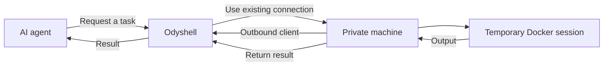

<p align="center">
  
</p>

<h1 align="center">Odyshell</h1>

<p align="center"><strong>A simple way for AI agents to work with private machines.</strong></p>

AI agents can use APIs and cloud services easily. Working with a real machine is still awkward:
it usually means sharing SSH credentials, exposing inbound ports, configuring a VPN, or
installing a complete coding agent on the machine.

Odyshell provides a smaller abstraction. A private machine runs a lightweight client, and that
client establishes an outbound connection to the Odyshell server. An agent can then request a
temporary session, perform a task, receive the result, and disconnect.

The agent never needs SSH credentials or direct access to the private network.

## How it works



The machine decides which directory and capabilities are available. Anything not explicitly
allowed is denied by the client. Tasks run in temporary Linux containers and results are returned
through the client's existing connection. The client runs on Linux, macOS, and Windows.

Odyshell is not an SSH client, VPN, or full coding agent. It is the infrastructure layer between
agents and private machines.

## What using it looks like

Agents can use the Odyshell API directly. The `ods` CLI is the quickest way to try the same
workflow:

```bash
ods machines
ods exec raspberry -- uname -a
ods shell raspberry "pwd && id"
ods fs write raspberry notes/hello.txt --content "Hello from an agent"
ods fs read raspberry notes/hello.txt
```

Commands can also return structured output:

```bash
ods --json exec raspberry -- uname -a
```

## Try it locally

You need Node.js 24+, pnpm, and Docker. On macOS and Windows, use Docker Desktop with Linux
containers enabled.

Install Odyshell and start the server:

```bash
pnpm install
pnpm install:ods
docker compose up -d --build
```

Connect the CLI:

```bash
ods login --server http://127.0.0.1:4100 --agent-token dev-agent-key --admin-key dev-admin-key
```

Create a one-time enrollment token:

```bash
ods token create
```

Choose a workspace, enroll the machine, and start its client:

```bash
mkdir odyshell-workspace

ods client doctor
ods client enroll --token <token> --name my-machine --workspace ./odyshell-workspace --allow process.exec,fs.stat,fs.list,fs.read
ods client start
```

Keep the client running. In another terminal:

```bash
ods exec my-machine -- uname -a
```

## Give an agent access

Create a token that only works with specific machines and actions:

```bash
ods machines
ods agent create coding-agent --machines <machine-id> --allow process.exec,fs.stat,fs.list,fs.read --ttl 86400
```

The token is shown once. Give that token to the agent, which can use it through the API or CLI:

```bash
ods --server http://127.0.0.1:4100 --agent-token <agent-token> exec my-machine -- uname -a
ods --server http://127.0.0.1:4100 --agent-token <agent-token> audit
```

The server restricts the token to its assigned machines and capabilities. The client applies its
own local allowlist as a second boundary. `ods audit` shows the current agent's session and
operation history.

## MVP status

Odyshell currently supports Linux, macOS, and Windows hosts, shell commands, filesystem
operations, Docker sandboxes, and temporary sessions.

It is an early development MVP. The default local credentials are only intended for development;
create scoped agent tokens for real agent access.
