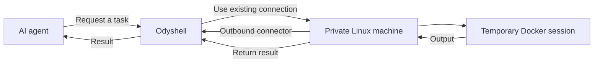

# Odyshell

**A simple way for AI agents to work with private Linux machines.**

AI agents can use APIs and cloud services easily. Working with a real machine is still awkward:
it usually means sharing SSH credentials, exposing inbound ports, configuring a VPN, or
installing a complete coding agent on the machine.

Odyshell provides a smaller abstraction. A private machine runs a lightweight connector, and
that connector establishes an outbound connection to Odyshell. An agent can then request a
temporary session, perform a task, receive the result, and disconnect.

The agent never needs SSH credentials or direct access to the private network.

## How it works



The machine decides which directory and capabilities are available. Tasks run in temporary
Docker sessions and results are returned through the connector's existing connection.

Odyshell is not an SSH client, VPN, or full coding agent. It is the infrastructure layer between
agents and private machines.

## What using it looks like

Agents can use the Odyshell API directly. The `ods` CLI is the quickest way to try the same
workflow:

```bash
ods machines
ods exec raspberry -- uname -a
ods shell raspberry "pwd && id"
ods fs write raspberry notes/hello.txt --content "Hello from an agent"
ods fs read raspberry notes/hello.txt
```

Commands can also return structured output:

```bash
ods --json exec raspberry -- uname -a
```

## Try it locally

You need Node.js 24+, pnpm, and Docker.

Install Odyshell and start the server:

```bash
pnpm install
pnpm install:ods
docker compose up -d --build
```

Connect the CLI:

```bash
ods login \
  --server http://127.0.0.1:4100 \
  --agent-key dev-agent-key \
  --admin-key dev-admin-key
```

Create a one-time enrollment token:

```bash
ods token create
```

Choose a workspace, enroll the machine, and start its connector:

```bash
mkdir odyshell-workspace

ods connector enroll \
  --token <token> \
  --name my-machine \
  --workspace ./odyshell-workspace

ods connector start
```

Keep the connector running. In another terminal:

```bash
ods exec my-machine -- uname -a
```

## MVP status

Odyshell currently supports Linux machines, shell commands, filesystem operations, Docker
sandboxes, and temporary sessions.

It is an early development MVP. The default local credentials are only intended for testing.
