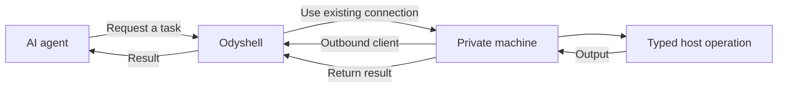

<p align="center">
  
</p>

<h1 align="center">Odyshell</h1>

<p align="center"><strong>Controlled execution for AI agents on private machines.</strong></p>

AI agents can use APIs and cloud services easily. Working with a real machine is still awkward:
it usually means sharing SSH credentials, exposing inbound ports, configuring a VPN, or
installing a complete coding agent on the machine.

Odyshell provides a smaller abstraction. A private machine runs a lightweight client, and that
client establishes an outbound connection to the Odyshell server. An agent can then request a
temporary session, perform a task, receive the result, and disconnect.

The agent never needs SSH credentials or direct access to the private network.

## How it works



The machine decides which capabilities are available. The web can add a concise description to
help agents identify it and can reduce the effective capability set, but cannot expand the Client
Local Policy. Anything not allowed by both boundaries is denied. Operations run as the
operating-system user running the Client and results return through its existing outbound
connection.

Odyshell is not an SSH client, VPN, or full coding agent. It is the infrastructure layer between
agents and private machines.

## Security principles

Odyshell treats every remote task as untrusted:

- Security is enforced by the Client and operating system, not by prompts.
- Agent permissions and local machine policy must both allow an operation.
- Relative paths in structured host Operations start from the Home directory of the
  operating-system user running the Client; exact absolute paths in those Operations require
  explicit Session approval. Host Shell instead grants broad authority before its paths are known.
- Structured process execution, explicit `host.shell`, filesystem writes, and Docker access are
  separate capabilities.
- Every session and operation is identified and bounded.
- Durable control events contain lifecycle metadata. Each Session snapshots its Workspace Timeline level: Privacy-minimal, Operational with automatic redaction, or complete Diagnostic detail.

Host Shell execution is intentionally direct. It starts in the Client user's Home by default; an
explicit per-command working directory does not narrow its authority. It has no sandbox or
isolation and can access that user's files, credentials, network, and services. Its changes may
persist after the Session ends. Use a dedicated operating-system user and grant that user only the
resources an Agent should control. Docker execution remains available as an optional isolated
Profile with a Docker-specific mount source.

Host Shell processes receive an allowlisted base environment, not every variable held by the
Client process. Explicit per-command environment values are ephemeral and never persisted. On
POSIX, the login shell can still load the user's startup files. Graceful cancellation stops active
process groups; without a separate Operation supervisor, an abrupt Client crash can leave a
detached POSIX command running until it exits or is stopped externally, and restart reconciliation
reports its result as unknown. Windows process-tree cancellation is best effort when the command
leader exits before its descendants. If graceful termination cannot be confirmed, the Client
quarantines that local Profile and refuses to reconnect after a service restart; remove and
re-enroll the Profile after investigating any surviving processes.

The Server blocks future work immediately after cancellation or revocation. A connected Client
receives terminal revocation and stops active work. A physically disconnected Client cannot receive
that signal: it accepts no new Operations and drops the revoked authority on its next contact. Until
then, the local command timeout and Session expiry bound already authorized execution.

## What using it looks like

Agents can use the Odyshell API directly. The `ods` CLI is the quickest way to try the same
workflow:

| Package manager | Command |
| --- | --- |
| pnpm | `pnpm add --global @odyshell/cli` |
| npm | `npm install --global @odyshell/cli` |
| Yarn | `yarn global add @odyshell/cli` |
| Bun | `bun add --global @odyshell/cli` |

```bash
ods machines
ods exec raspberry -- uname -a
ods shell --purpose "Inspect the user environment" raspberry "pwd && id"
ods fs search raspberry package.json
ods fs write raspberry notes/hello.txt --content "Hello from an agent"
ods fs read raspberry notes/hello.txt
ods docker logs raspberry api --tail 100
```

Commands can also return structured output:

```bash
ods --json exec raspberry -- uname -a
```

## Try it locally

You need Node.js 24+, pnpm, Docker, and a Clerk application with Organizations enabled. On macOS
and Windows, use Docker Desktop with Linux containers enabled. The normal CLI uses the same human
approval flow locally as it does in production, so the web app is part of this setup.

Install Odyshell and create the local environment files:

```bash
pnpm install
pnpm install:ods
cp .env.example .env
cp apps/web/.env.example apps/web/.env.local
```

Replace the Clerk keys in `apps/web/.env.local`. Set the same random `ODYSHELL_WEB_KEY` in both
files and keep `ODYSHELL_WEB_URL=http://localhost:3000`. Then start PostgreSQL and the Server:

```bash
docker compose up -d --build
```

In another terminal, start the human control plane and create a Clerk Organization at
`http://localhost:3000`:

```bash
pnpm dev:web
```

State persists in a Docker volume. The bundled administrator and development credentials are only
for local development and must not be exposed to the internet. They do not replace browser
approval for the normal CLI Session flow.

Connect the CLI:

```bash
ods login --server http://127.0.0.1:4100
```

Open the printed URL and approve the CLI for the local Organization.

Create a one-time enrollment token:

```bash
ods token create
```

On a Linux, macOS, or Windows machine, connect it and start the persistent outbound Client:

```bash
ods up \
  --server http://127.0.0.1:4100 \
  --token <token> \
  --name my-machine \
  --allow 'process.exec,fs.stat,fs.list,fs.search,fs.read,fs.write'
```

`ods up` installs a restartable user service. In another terminal:

```bash
ods exec my-machine -- uname -a
```

Inspect the local Client Profiles and their background status:

```bash
ods profiles ls
ods profiles configure default --allow-sudo
```

Installed Linux services set `NoNewPrivileges` while sudo is disabled. Enabling sudo is a local,
explicit policy change and requires passwordless sudo on that host. A foreground Client has no
service-level privilege boundary and reports effective `sudo -n` so approvals can warn. Odyshell
does not claim equivalent enforcement on macOS or Windows.

Check that the complete path to a machine is working:

```bash
ods ping my-machine
```

## Upgrade to Client protocol v4

Odyshell 0.16 uses Client protocol v4 because recursive `fs.remove` is no longer accepted. Update
the Server and CLI together, then restart every enrolled Profile. Existing Profile configuration
remains valid and re-enrollment is not required.

### Legacy protocol v3 Profile migration

Protocol v3 intentionally rejects older Client Profile configuration. Stop and remove every old
Profile, remove its stale machine record in the dashboard, then generate a new enrollment command
and run it with the same Profile name. There is no automatic conversion of the old filesystem
boundary:

```bash
ods down --profile default
ods profiles remove default
# Run the new ods up command generated by the dashboard.
```

Host Profiles no longer accept `workspaceRoot`; relative paths and Host Shell commands start in
the operating-system user's Home. Docker Profiles instead require an explicit host directory at
enrollment with `--runner docker --mount-source <absolute-path>`. Recreate and re-enroll both kinds
of Profile rather than copying or editing a protocol v2 configuration.

## Self-hosting

Odyshell can run with the Server, PostgreSQL, and browser-approval web app on infrastructure you
control. The Clients still use outbound-only connections and do not expose ports.

See the [minimal self-hosting guide](./docs/self-hosting.md) for the current setup and production
security checklist.

## Use Odyshell Cloud

Cloud users create an account and organization in the web app. The organization owns the
Odyshell workspace; organization membership is intentionally not managed by the CLI.

Connect `ods` without copying a permanent administrator key:

```bash
ods login
```

The CLI prints and opens a short-lived Odyshell activation link with the device code already
included. After you approve it, `ods` receives an expiring workspace credential. The browser
session and Clerk credentials never leave the web app. This login authorizes the human-facing CLI
to use Workspace resources; it does not identify or enroll a target Client. Self-hosted
installations can still select their Server with `--server`.

From the dashboard, generate the one-time `ods up` command for a machine. The enrollment token
expires after ten minutes and can only be used once. You explicitly select the local operations
that machine will accept. The target machine does not run `ods login`: an authenticated Workspace
member creates the command, and the target only uses its single-use enrollment token.

## Connect an Agent

Register the Agent once:

```bash
ods agent login "My Agent"
```

MCP-compatible agents can use the browser-approved flow after `ods login`:

```json
{
  "mcpServers": {
    "odyshell": {
      "command": "ods",
      "args": ["mcp"]
    }
  }
}
```

A Server configured with Clerk OAuth can expose the same tools as a remote MCP. It creates one
persistent Agent per approved installation and keeps Session authority inside the Server, so
hosted clients such as Claude or ChatGPT do not need a local `ods` process.

The Agent keeps a persistent identity but receives no machine authority from login. It requests a
temporary Session for either exact typed Operations or explicit broad Host Shell authority, shows
the approval URL to the user and waits, privately claims the credential once approved, performs the
task, and completes the Session.
Programmatic Host Shell requests carry a stable Task Run identifier: failed commands can be
corrected within that Session, but unrelated work cannot inherit its authority. The Agent
explicitly completes the Session when the overall task succeeds or is abandoned; expiry is only a
fallback.
The Server enforces the immutable machine, capability, path, and expiry; the Client applies its own
local policy as a second boundary.

Independent Agents can propose versioned autoapproval policies for repeated bounded work. An
administrator approves the exact ceiling once; requests inside it autoapprove, while wider
requests remain pending. The dashboard keeps policy history and every resulting Session records
the policy version that authorized it. `host.shell` is excluded from Autoapproval and Delegation
Policies and always requires a human decision.

For unattended work, approve a temporary Autoapproval Policy. The policy is only a ceiling; every
task still receives its own expiring Session.

## MVP status

Odyshell currently supports typed process, explicit Host Shell, filesystem, and Docker log
Operations. Direct host execution is the default. Docker sandboxes remain an optional execution
Profile.

Structured filesystem work is locally resource-bounded: `fs.read` accepts regular files up to
1 MiB, `fs.write` accepts up to 1 MiB of decoded content, `fs.list` accepts up to 1,000 entries,
and `fs.search` visits at most 2,048 nodes and 32 directory levels. `fs.remove` deletes one file or
empty directory; recursive removal is not exposed in the MVP. Exceeding a limit fails the
Operation without returning a partial result. Filesystem Operations observe deadline and Session
cancellation cooperatively and suppress late results. Relative Session scopes reject symlink roots
and descendant symlinks that resolve outside the approved subtree.

The Server keeps machine identities, temporary Sessions, Operations, and audit history in PostgreSQL
through Kysely. Persistable Operation action fields and output are retained for one hour by default;
environment values and standard input are excluded. Content-minimal Control Events are retained for
30 days. Session Timelines default to lifecycle events, Operation kind and exit status without
commands, paths or output. Workspace administrators can enable Operational or Diagnostic detail for
new Sessions. The authenticated Session screen can separately show a redacted recent Host Shell
command while its temporary Operation data remains; Privacy-minimal exports and Event Sinks never
receive it.

Organizations provide the ownership boundary and workspaces isolate machines, Agents, Sessions,
operations, and control events. Human and organization identity now live in the Clerk-backed web
app. Device authorization binds the CLI to one workspace, while Agent Credentials identify
integrations and Session Credentials authorize temporary work. Organization members can operate workspace resources; organization
administrators additionally manage people and organization settings. Billing is not enabled yet. It is an early development MVP; the
default local credentials are only for development.

## Product documents

- [Public documentation](https://odyshell.com/docs)
- [MVP scope and current behavior](./docs/mvp.md)
- [Privacy and event data](./docs/privacy.md)
- [Business model](./docs/business-model.md)
- [Self-hosting](./docs/self-hosting.md)
