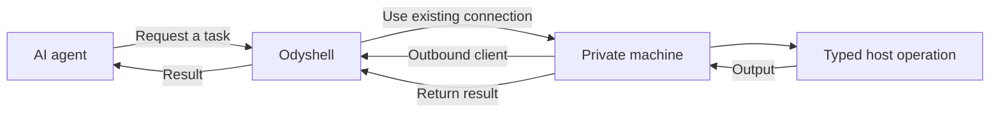

<p align="center">
  
</p>

<h1 align="center">Odyshell</h1>

<p align="center"><strong>Controlled execution for AI agents on private machines.</strong></p>

AI agents can use APIs and cloud services easily. Working with a real machine is still awkward:
it usually means sharing SSH credentials, exposing inbound ports, configuring a VPN, or
installing a complete coding agent on the machine.

Odyshell provides a smaller abstraction. A private machine runs a lightweight client, and that
client establishes an outbound connection to the Odyshell server. An agent can then request a
temporary session, perform a task, receive the result, and disconnect.

The agent never needs SSH credentials or direct access to the private network.

## How it works



The machine decides which workspace and capabilities are available. Anything not explicitly
allowed is denied by the Client. Operations run as the operating-system user running the Client
and results return through its existing outbound connection.

Odyshell is not an SSH client, VPN, or full coding agent. It is the infrastructure layer between
agents and private machines.

## Security principles

Odyshell treats every remote task as untrusted:

- Security is enforced by the Client and operating system, not by prompts.
- Agent permissions and local machine policy must both allow an operation.
- Filesystem operations default to the configured workspace; exact absolute host paths require
  explicit Session approval and a host profile.
- Process execution, shell access, filesystem writes, and Docker access are separate capabilities.
- Every session and operation is identified and bounded.
- Durable control events contain lifecycle metadata; Session Timelines retain only a conservatively redacted command shape and exit status, never command output.

Host execution is intentionally direct: it can do anything available to the user running the
Client. Use a dedicated operating-system user and grant that user only the files and services an
agent should control. Docker execution remains available as an optional isolated profile.

## What using it looks like

Agents can use the Odyshell API directly. The `ods` CLI is the quickest way to try the same
workflow:

| Package manager | Command |
| --- | --- |
| pnpm | `pnpm add --global @odyshell/cli` |
| npm | `npm install --global @odyshell/cli` |
| Yarn | `yarn global add @odyshell/cli` |
| Bun | `bun add --global @odyshell/cli` |

```bash
ods machines
ods exec raspberry -- uname -a
ods shell raspberry "pwd && id"
ods fs search raspberry package.json
ods fs write raspberry notes/hello.txt --content "Hello from an agent"
ods fs read raspberry notes/hello.txt
ods docker logs raspberry api --tail 100
```

Commands can also return structured output:

```bash
ods --json exec raspberry -- uname -a
```

## Try it locally

You need Node.js 24+, pnpm, and Docker. On macOS and Windows, use Docker Desktop with Linux
containers enabled.

Install Odyshell and start the server:

```bash
pnpm install
pnpm install:ods
docker compose up -d --build
```

This starts the development Server and PostgreSQL. State persists in a Docker volume. The bundled
credentials are only for local development and must not be exposed to the internet.

Connect the CLI:

```bash
ods login --server http://127.0.0.1:4100 --agent-token dev-agent-key --admin-key dev-admin-key
```

Create a one-time enrollment token:

```bash
ods token create
```

On a Linux, macOS, or Windows machine, connect it and start the persistent outbound Client:

```bash
ods up \
  --server http://127.0.0.1:4100 \
  --token <token> \
  --name my-machine \
  --allow 'process.exec,fs.stat,fs.list,fs.search,fs.read,fs.write'
```

`ods up` installs a restartable user service. In another terminal:

```bash
ods exec my-machine -- uname -a
```

Inspect the local Client Profiles and their background status:

```bash
ods profiles ls
```

Check that the complete path to a machine is working:

```bash
ods ping my-machine
```

## Self-hosting

Odyshell can run with the Server and PostgreSQL on infrastructure you control. The Clients
still use outbound-only connections and do not expose ports.

See the [minimal self-hosting guide](./docs/self-hosting.md) for the current setup and production
security checklist.

## Use Odyshell Cloud

Cloud users create an account and organization in the web app. The organization owns the
Odyshell workspace; organization membership is intentionally not managed by the CLI.

Connect `ods` without copying a permanent administrator key:

```bash
ods login
```

The CLI prints and opens a short-lived Odyshell activation link with the device code already
included. After you approve it, `ods` receives an expiring workspace credential. The browser
session and Clerk credentials never leave the web app. Self-hosted installations can still select
their Server with `--server`.

From the dashboard, generate the one-time `ods up` command for a machine. The enrollment token
expires after ten minutes and can only be used once. You explicitly select the local operations
that machine will accept.

## Connect an Agent

Register the Agent once:

```bash
ods agent login "My Agent"
```

MCP-compatible agents can use the browser-approved flow after `ods login`:

```json
{
  "mcpServers": {
    "odyshell": {
      "command": "ods",
      "args": ["mcp"]
    }
  }
}
```

A Server configured with Clerk OAuth can expose the same tools as a remote MCP. It creates one
persistent Agent per approved installation and keeps Session authority inside the Server, so
hosted clients such as Claude or ChatGPT do not need a local `ods` process.

The Agent keeps a persistent identity but receives no machine authority from login. It requests a
temporary Session for a bounded group of typed operations, shows the approval URL to the user and
waits, privately claims the credential once approved, performs the task, and completes the Session.
The Server enforces the immutable machine, capability, path, and expiry; the Client applies its own
local policy as a second boundary.

Independent Agents can propose versioned autoapproval policies for repeated bounded work. An
administrator approves the exact ceiling once; requests inside it autoapprove, while wider
requests remain pending. The dashboard keeps policy history and every resulting Session records
the policy version that authorized it.

For unattended work, approve a temporary Autoapproval Policy. The policy is only a ceiling; every
task still receives its own expiring Session.

## MVP status

Odyshell currently supports typed process, shell, filesystem, and Docker log operations. Direct
host execution is the default. Docker sandboxes remain an optional execution profile.

The Server keeps machine identities, temporary access, operations, and audit history in PostgreSQL
through Kysely. Operation payloads are retained for one hour by default; content-minimal control
events are retained for 30 days. Session Timelines retain lifecycle events, sanitized commands and
exit status without recording stdout, stderr, file contents, or credentials.

Organizations provide the ownership boundary and workspaces isolate machines, Agents, Sessions,
operations, and control events. Human and organization identity now live in the Clerk-backed web
app. Device authorization binds the CLI to one workspace, while Agent Credentials identify
integrations and Session Credentials authorize temporary work. Organization members can operate workspace resources; organization
administrators additionally manage people and organization settings. Billing is not enabled yet. It is an early development MVP; the
default local credentials are only for development.

## Product documents

- [Public documentation](https://odyshell.com/docs)
- [MVP scope and current behavior](./docs/mvp.md)
- [Privacy and event data](./docs/privacy.md)
- [Business model](./docs/business-model.md)
- [Self-hosting](./docs/self-hosting.md)
