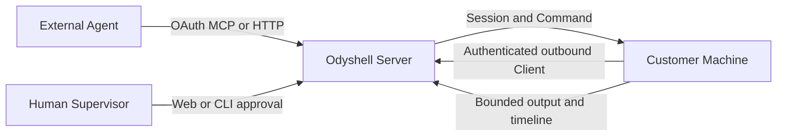

<p align="center">
  
</p>

<h1 align="center">Odyshell</h1>

<p align="center"><strong>Temporary, attributable shell access for AI agents.</strong></p>

Odyshell lets external AI Agents run temporary, attributable shell Sessions on customer-controlled
Windows, Linux, and macOS Machines without SSH credentials, inbound ports, VPN access, or a coding agent installed on
the target.

Agents are the primary operators. Standard Agents require an explicit Human decision for every
Session. An Operator Agent can open Sessions without that decision and should be treated like an
Agent that has been given SSH access. Every Session remains bounded, revocable, and attributable.

## Architecture



The Server owns identity, authorization, idempotency, lifecycle, and audit. The Client independently
enforces its owner-controlled Local Policy. A Server cannot widen the Organization, duration,
concurrency, timeout, or output limits advertised by the Machine. Agent-to-Machine authority
exists only inside an authorized Session.

## Core model

- **Organization** owns identities, Machines, policies, Sessions, Commands, and audit data.
- **Agent** is a persistent OAuth identity used by an external runtime.
- **Machine** is one outbound Windows, Linux, or macOS Client running as one operating-system user.
- **Local Policy** is the Machine owner's hard ceiling.
- **Agent role** is `Standard` (approval required) or `Operator` (approval bypass).
- **Session** grants one Agent temporary authority on one Machine.
- **Command** is asynchronous, non-interactive shell text inside one active Session.

A Command may provide only shell text, an absolute working directory, and a bounded timeout. It
cannot inject environment variables or standard input. Output is bounded and retained for the
Organization's timeline retention period; Session and
Command state can be resumed after transport reconnects. Mutations require explicit idempotency
keys.

## Security boundary

Commands run directly as the operating-system user running the Client. There is no sandbox, rollback, privilege-elevation
setup, or command filter. Use a dedicated user without root, sudo, or Docker membership and grant
only the files, credentials, network, and services the Agent needs.

The control plane rejects cross-Organization and cross-Agent work. The Client independently rejects
cross-Organization work, mismatched Session identity, overlong Sessions or Commands, excess concurrency
and output, replay, expired authority, and malformed protocol messages. Enrollment
tokens expire after ten minutes, work once, and are never persisted.

## Quickstart

1. Open the web app and create an account; Odyshell creates and activates its Organization.
2. Connect the Agent runtime to the Server's remote MCP endpoint and complete OAuth.
3. Install `ods` on the target Windows, Linux, or macOS Machine:

   ```bash
   npm install --global @odyshell/cli
   ```

4. In **Machines**, select **Add Machine** and run the generated `ods up` command on the host. The
   Machine belongs to the Organization; no Agent is selected during enrollment.
5. From the Agent, call `machines_list`, `session_request`, `command_run`, `command_get`,
   `command_output`, and `session_complete`. A Supervisor approves only when policy requires it.

Humans can use the same control plane from the CLI:

```bash
ods status
ods login
ods machines list
ods sessions list
ods sessions approve <session-id>
ods sessions timeline <session-id>
ods agents role <agent-id> operator
ods profiles ls
ods client doctor --profile default
ods client update --check --profile default
```

## Self-host locally

You need Node.js 24+, pnpm, and Docker:

```bash
cp .env.example .env
docker compose up -d --build
pnpm test:self-host
```

Fill every blank secret in the root `.env` before starting. Open
`http://localhost:3000`; the first local account automatically owns the deployment Organization. Then follow the
Quickstart. Compose runs both application services in production mode, binds them to loopback by
default, and rejects missing secrets.

Self-hosting uses the same Server, web app, PostgreSQL schema, identity architecture, protocols,
dashboard, and Client as Cloud. The deployment owner keeps identity, policy, Session, audit, and
credential data in its own PostgreSQL database. See the [self-hosting guide](./docs/self-hosting.md).

## Development

```bash
pnpm test
pnpm typecheck
pnpm build
```

Repository packages:

- `apps/server`: canonical HTTP, remote MCP adapter, OAuth, gateway, audit, Session/Command lifecycle.
- `apps/client`: authenticated outbound Windows/Linux/macOS Client and local enforcement.
- `apps/web`: Better Auth, Organization dashboard, optional supervision, and documentation.
- `apps/cli`: Machine installation, Human OAuth, supervision, and Session/Command operations.
- `packages/protocol`: shared wire contracts.
- `packages/mcp`: agent-native MCP tools over the canonical Session module.

Accepted target architecture is recorded in [`docs/design`](./docs/design). Product terminology and
commercial limits are defined in [`CONTEXT.md`](./CONTEXT.md) and [`docs/business-model.md`](./docs/business-model.md).
