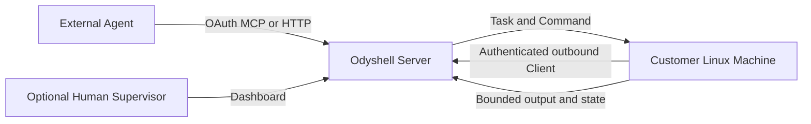

<p align="center">
  
</p>

<h1 align="center">Odyshell</h1>

<p align="center"><strong>Agent-native infrastructure for controlled work on private Linux Machines.</strong></p>

Odyshell lets external AI Agents run temporary, attributable shell Tasks on customer-controlled
Linux Machines without SSH credentials, inbound ports, VPN access, or a coding agent installed on
the target.

Agents are the primary operators. Humans establish trust and policy, inspect audit data, and may
supervise high-risk Tasks; supervision is optional when Autonomy Policy permits execution.

## Architecture



The Server owns identity, authorization, idempotency, lifecycle, and audit. The Client independently
enforces its owner-controlled Local Policy. A Server cannot widen the Organization, Agent,
duration, concurrency, timeout, or output limits advertised by the Machine.

## Core model

- **Organization** owns identities, Machines, policies, Tasks, Commands, and audit data.
- **Agent** is a persistent OAuth identity used by an external runtime.
- **Machine** is one outbound Linux Client running as one operating-system user.
- **Local Policy** is the Machine owner's hard ceiling.
- **Autonomy Policy** decides whether a matching Task can start without a human.
- **Task** grants one Agent temporary authority on one Machine.
- **Command** is asynchronous, non-interactive shell text inside one active Task.

A Command may provide only shell text, an absolute working directory, and a bounded timeout. It
cannot inject environment variables or standard input. Output is bounded and transient; Task and
Command state can be resumed after transport reconnects. Mutations require explicit idempotency
keys.

## Security boundary

Commands run directly as the Linux user running the Client. There is no sandbox, rollback, sudo
setup, or command filter. Use a dedicated user without root, sudo, or Docker membership and grant
only the files, credentials, network, and services the Agent needs.

The Client rejects cross-Organization and cross-Agent work, overlong Tasks or Commands, excess
concurrency and output, replay, expired authority, and malformed protocol messages. Enrollment
tokens expire after ten minutes, work once, and are never persisted.

## Quickstart

1. Open the web app and create an account; Odyshell creates and activates its Organization.
2. Connect the Agent runtime to the Server's remote MCP endpoint and complete OAuth.
3. Install `ods` on the target Linux Machine:

   ```bash
   npm install --global @odyshell/cli
   ```

4. In **Machines**, select **Add Machine** and run the generated `ods up` command on the host.
   Selecting an initially allowed Agent is optional.
5. From the Agent, call `machines_list`, `task_request`, `command_run`, `command_get`,
   `command_output`, and `task_complete`. A Supervisor approves only when policy requires it.

`ods` is intentionally limited to Machine installation and diagnostics:

```bash
ods status
ods profiles ls
ods client doctor --profile default
ods client update --check --profile default
```

## Self-host locally

You need Node.js 24+, pnpm, and Docker:

```bash
cp .env.example .env
docker compose up -d --build
pnpm test:self-host
```

Fill every blank secret in the root `.env` before starting. Open
`http://localhost:3000`; the first local account automatically owns the deployment Organization. Then follow the
Quickstart. Compose runs both application services in production mode, binds them to loopback by
default, and rejects missing secrets.

Self-hosting uses the same Server, web app, PostgreSQL schema, identity architecture, protocols,
dashboard, and Client as Cloud. The deployment owner keeps identity, policy, Task, audit, and
credential data in its own PostgreSQL database. See the [self-hosting guide](./docs/self-hosting.md).

## Development

```bash
pnpm test
pnpm typecheck
pnpm build
```

Repository packages:

- `apps/server`: canonical HTTP, remote MCP adapter, OAuth, gateway, audit, Task/Command lifecycle.
- `apps/client`: authenticated outbound Linux Client and local enforcement.
- `apps/web`: Better Auth, Organization dashboard, optional supervision, and documentation.
- `apps/cli`: Linux Machine installation and diagnostics.
- `packages/protocol`: shared wire contracts.
- `packages/mcp`: agent-native MCP tools over the canonical Task module.

Accepted target architecture is recorded in [`docs/design`](./docs/design); shipped MVP progress is
tracked in [`docs/MVP_PLAN.md`](./docs/MVP_PLAN.md).
