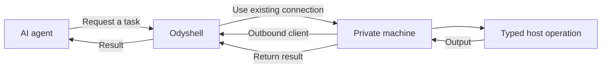

<p align="center">
  
</p>

<h1 align="center">Odyshell</h1>

<p align="center"><strong>A simple way for AI agents to work with private machines.</strong></p>

AI agents can use APIs and cloud services easily. Working with a real machine is still awkward:
it usually means sharing SSH credentials, exposing inbound ports, configuring a VPN, or
installing a complete coding agent on the machine.

Odyshell provides a smaller abstraction. A private machine runs a lightweight client, and that
client establishes an outbound connection to the Odyshell server. An agent can then request a
temporary session, perform a task, receive the result, and disconnect.

The agent never needs SSH credentials or direct access to the private network.

## How it works



The machine decides which workspace and capabilities are available. Anything not explicitly
allowed is denied by the Client. Operations run as the operating-system user running the Client
and results return through its existing outbound connection.

Odyshell is not an SSH client, VPN, or full coding agent. It is the infrastructure layer between
agents and private machines.

## Security principles

Odyshell treats every remote task as untrusted:

- Security is enforced by the Client and operating system, not by prompts.
- Agent permissions and local machine policy must both allow an operation.
- Filesystem operations stay inside the configured workspace.
- Process execution, shell access, filesystem writes, and Docker access are separate capabilities.
- Every session and operation is identified, bounded, and audited.

Host execution is intentionally direct: it can do anything available to the user running the
Client. Use a dedicated operating-system user and grant that user only the files and services an
agent should control. Docker execution remains available as an optional isolated profile.

## What using it looks like

Agents can use the Odyshell API directly. The `ods` CLI is the quickest way to try the same
workflow:

```bash
ods machines
ods exec raspberry -- uname -a
ods shell raspberry "pwd && id"
ods fs search raspberry package.json
ods fs write raspberry notes/hello.txt --content "Hello from an agent"
ods fs read raspberry notes/hello.txt
ods docker logs raspberry api --tail 100
```

Commands can also return structured output:

```bash
ods --json exec raspberry -- uname -a
```

## Try it locally

You need Node.js 24+, pnpm, and Docker. On macOS and Windows, use Docker Desktop with Linux
containers enabled.

Install Odyshell and start the server:

```bash
pnpm install
pnpm install:ods
docker compose up -d --build
```

Connect the CLI:

```bash
ods login --server http://127.0.0.1:4100 --agent-token dev-agent-key --admin-key dev-admin-key
```

Create a one-time enrollment token:

```bash
ods token create
```

On a Linux machine, connect a workspace and start the persistent outbound Client:

```bash
ods up \
  --server http://127.0.0.1:4100 \
  --token <token> \
  --name my-machine \
  --workspace /srv/my-app \
  --allow process.exec,fs.stat,fs.list,fs.search,fs.read,fs.write
```

`ods up` installs a restartable user service. In another terminal:

```bash
ods exec my-machine -- uname -a
```

Check that the complete path to a machine is working:

```bash
ods ping my-machine
```

## Give an agent access

Create a token that only works with specific machines and actions:

```bash
ods machines
ods agent create coding-agent --machines <machine-id> --allow process.exec,fs.stat,fs.list,fs.search,fs.read --for 1h
```

The token is shown once. Give that token to the agent, which can use it through the API or CLI:

```bash
ods --server http://127.0.0.1:4100 --agent-token <agent-token> exec my-machine -- uname -a
ods --server http://127.0.0.1:4100 --agent-token <agent-token> audit
```

MCP-compatible agents can launch the same interface locally with `ods mcp`:

```json
{
  "mcpServers": {
    "odyshell": {
      "command": "ods",
      "args": ["mcp"]
    }
  }
}
```

The Server restricts the token to its assigned machines and capabilities. The Client applies its
own local policy as a second boundary. When the token expires, its sessions are closed too, so an
agent cannot keep access through an older session. `ods audit` shows the current agent's history;
administrators can use `ods audit --all`, `ods agent list`, and `ods agent revoke <agent-id>`.

## MVP status

Odyshell currently supports typed process, shell, filesystem, and Docker log operations. Direct
host execution is the default. Docker sandboxes remain an optional execution profile.

The Server keeps machine identities, temporary access, operations, and audit history in Convex.
Railway remains the connection gateway; Convex does not connect to private machines. Local Docker
tests use an ephemeral store and do not appear in a real workspace.

It is an early development MVP. The default local credentials are only intended for development.
