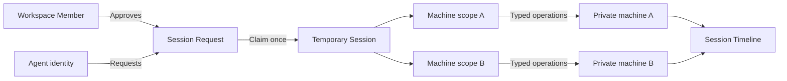
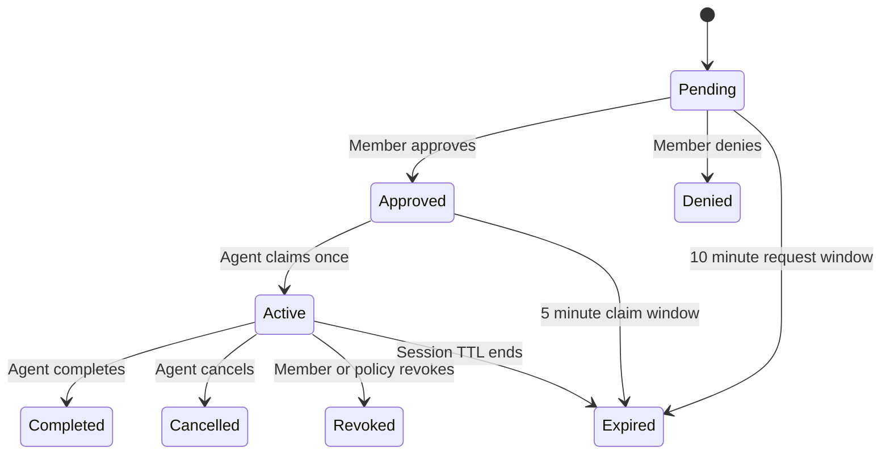

# Agent and Session model

> **Status:** Accepted product and architecture design. Typed, multi-machine Session Scopes are
> implemented for filesystem, structured process execution, and Docker logs. Local stdio and
> remote Clerk OAuth MCP transports share the typed, approval-based Session tools.
>
> Headless Agent Credentials, renewal, typed multi-machine scopes, strict Session termination, and
> versioned policies, and one-level Managed Agent delegation are implemented.

## Goal

Odyshell lets programmatic Agents perform bounded tasks on real private machines without SSH
credentials, inbound ports, private-LAN access, a VPN, or a full coding Agent installed on every
target.

The Web application is an approval, configuration, observability, and recovery surface. It is not
a required hop for normal programmatic operation. Agents use the canonical API through MCP, SDK,
or CLI.

## Core model

An Agent is persistent. Authority is temporary.



The legacy model attaches machines, capabilities, expiry, and a bearer credential to one Agent
Access record. The accepted model separates four concerns:

| Concern | Domain object |
| --- | --- |
| Durable programmatic identity | Agent |
| Proof of that identity | Agent Credential |
| Temporary task authority | Session |
| Proof of active task authority | Session Credential |

Registering an Agent never grants machine access. A Session is the only source of authority for
Agent Operations.

## Agents

An Agent represents a logical security principal, such as `Claude — Karim desktop`, `OpenClaw`,
`Dependency updater`, or `Log investigator`. It does not represent every model invocation,
process, subagent, or task.

### Independent Agents

An Independent Agent has an Agent Credential and can authenticate and request Sessions for
itself. It can become an orchestrator only through a separately approved Delegation Policy.

Agent Credentials:

- prove identity but never execute Operations;
- last 90 days by default and at most one year in Odyshell Cloud;
- offer 30-day, 90-day, 6-month, and 1-year durations;
- are returned only to the trusted runtime and stored hashed by the Server;
- can be rotated with at most ten minutes of overlap;
- cannot be reissued by the Agent for itself.

OAuth integrations follow the identity provider's access and refresh lifecycle. Revoking an OAuth
installation invalidates the corresponding Agent identity credential.

### Managed Agents

A Managed Agent is a persistent identity owned by one Independent Agent. It has no Agent
Credential; its parent requests Sessions in its name and gives workers only Session Credentials.

Delegation has one level:

```text
Independent Agent
├── Managed Agent
├── Managed Agent
└── Managed Agent
```

A Managed Agent cannot create descendants. Its parent can list, disable, or delete it. Transfer
and promotion remain future administrative recovery operations.

Disabling or revoking a parent:

- disables its Managed Agents;
- revokes their active Sessions;
- cancels their active Operations;
- preserves identities and Timelines for audit or transfer.

## Session Requests

A Session Request contains:

- the Agent that will execute;
- the Agent or human that requested it;
- a required short title;
- an optional longer purpose;
- an optional structured plan;
- requested duration;
- one or more per-machine Session Scopes.

Purpose and plan are untrusted Agent-provided context. They help a human understand the request
and build the Timeline, but they never participate in authorization.

A request outside an active Autoapproval Policy remains pending. `session_request` returns
immediately with a request identifier, an approval URL, and an expiry instead of blocking a tool
call. The Agent checks it later with `session_status`.

The request can be approved or denied, but not partially edited. If the requester needs different
authority, it creates a new request.

### Approval and claim



Session duration begins when the Client confirms the first target is ready, not while approval is
pending. An approved target has 60 seconds for each opening attempt. A failed attempt remains
closed, but the same immutable target can retry if its Client reconnects before the Session
expires. MCP keeps the Session Credential internally so the model never sees it. API and SDK
orchestrators can receive the credential once and inject it into a trusted worker.

## Sessions

A Session is an immutable authorization for one task. It can target multiple machines, but every
machine has an independent scope and readiness state.

```ts
type Session = {
  agentId: string;
  title: string;
  purpose?: string;
  expiresAt: string;
  targets: Array<{
    machineId: string;
    capabilities: string[];
    restrictions: {
      filesystem?: {
        paths: Array<{ path: string; includeDescendants: boolean }>;
      };
      process?: {
        programs: Array<{
          program: string;
          args: string[];
          cwd: { path: string; includeDescendants: boolean };
        }>;
      };
      docker?: {
        containers: string[];
      };
    };
  }>;
};
```

Typed restrictions narrow capability grants:

- filesystem capabilities may apply across the machine or be narrowed to exact normalized paths
  and explicit descendant trees;
- `process.exec` accepts an exact program, argument array, and working-directory restriction;
- `docker.logs` accepts exact container names;
- initial policy does not use regular expressions;
- unknown or malformed restrictions fail closed.

`host.shell` is intentionally broader than typed Operations. It grants independent native shell
commands for the Session duration, is never autoapproved or delegated, and is bounded by the
machine Local Policy. Each Operation starts in the Client user's Home by default and runs with
every resource that user can access; a per-command working directory does not narrow that authority.
It does not create a sandbox, persistent terminal, PTY, or shared shell state, but its changes may
persist after the Session ends. The process inherits an allowlisted Client base environment;
explicit environment values are ephemeral to one Operation and never persisted. On POSIX, the
login shell can still load the user's startup files. See the accepted
[Host Shell specification](./host-shell.md).

Manual dashboard creation uses Read only as its sole structured convenience preset. Host Shell is
a separate explicit selection and no preset bundles it with structured filesystem authority. A
member may explicitly select both when the task requires both kinds of authority. Every selection
is intersected with the Client Local Policy. An installed Linux service sets `NoNewPrivileges`
unless the machine owner explicitly enables passwordless sudo for that local Client Profile. A
foreground Client retains the user's actual authority and reports effective `sudo -n`, even when
the Profile setting is disabled. When root access is effective, every creation or approval surface
adds a root warning without replacing the same-user warning. Odyshell does not claim an equivalent
enforcement boundary on macOS or Windows. Exact `process.exec` program and argument restrictions
remain an Agent, MCP, API, SDK, and CLI concern. The Server validates the manual allowlist
independently; the dashboard is not an authorization boundary.

### Duration and renewal

The dashboard offers Session presets of 5 minutes, 15 minutes, 1 hour, 4 hours, 8 hours, and
24 hours, with a 1-hour default. MCP also defaults to 1 hour. API, SDK, and MCP requests accept
whole-second durations from 60 seconds through 24 hours; SDK callers provide the duration
explicitly. Single-operation CLI commands, including `ods shell`, default to 5 minutes. No Session
can be permanent.

An active Session is never extended or widened. `renew` creates a successor Session with a new
identifier, approval decision, and credential. It can preserve or reduce scope; expanding
authority is a new request.

### Per-target readiness

Approval is atomic, but readiness is independent:

```text
Session: Active

desktop       Ready
raspberry-pi  Offline
production    Rejected by Local Policy
```

An offline or rejected target does not block available targets. A target that reconnects before
Session expiry can become ready. Odyshell never reduces requested scope silently to make a target
work.

### Completion and cancellation

`session_complete` requires no active Operations. Odyshell records verified lifecycle and
Operation results; the Agent may report `succeeded` or `failed` with an optional summary, which is
visibly marked as Agent-reported.

`session_cancel`, expiry, and security revocation cancel active Operations. Transport loss alone
does not: an already authorized Operation continues under its local timeout and Session deadline,
the disconnected Client accepts no new Operations, output buffering remains bounded, and the result
is reconciled after reauthentication. Output remains unconfirmed until the Server acknowledges the
terminal result; disconnect or restart before that acknowledgement reports it as truncated.
Process cancellation terminates the process group so children
cannot survive the Session when the Client performs the cancellation. Without a separate Operation
supervisor, an abrupt Client crash can leave a detached POSIX command running until it exits or is
stopped externally; restart reconciliation records an unknown result rather than assuming it was
terminated.

## Authorization

The effective authority for an Operation is the intersection of independent boundaries:

```text
Workspace isolation
∩ Agent or Managed Agent policy
∩ Session Scope for the selected machine
∩ Session lifetime and status
∩ Client Local Policy
∩ typed Operation validation
```

Every Operation references an explicit Session and machine. Odyshell derives the required
Capability from the Operation kind:

```text
filesystem_read → fs.read
process_exec    → process.exec
host.shell      → host.shell
docker_logs     → docker.logs
```

The caller never repeats a capability list during execution.

## Policies

### Autoapproval Policy

An Autoapproval Policy defines Sessions that an Agent can claim without a new human decision. It
does not create an active grant.

Defaults:

- 30 days validity;
- selectable validity of 1 day, 7 days, 30 days, 90 days, or 1 year;
- maximum one year;
- no permanent option.

Any request exceeding the policy becomes pending for human approval. The Server never partially
autoapproves it.

### Delegation Policy

A Delegation Policy lets an Independent Agent create Managed Agents and assign their policies
without repeated approvals. It defines:

- maximum Managed Agent count;
- per-machine maximum capabilities and restrictions;
- maximum Session duration;
- policy validity.

Every Managed Agent policy must be a subset of its parent's Delegation Policy and cannot outlive
it. The effective authority is:

```text
Parent Delegation Policy
∩ Managed Agent Policy
∩ Session Scope
∩ Client Local Policy
```

An Agent can propose policies through MCP or API. An Organization Admin approves them through a
standalone browser route. The Agent cannot edit or approve its own ceiling.

## Credentials

### Session Credentials

A claimed Session returns a one-time Session Credential:

- the Server stores only its hash;
- it expires exactly with the Session;
- it cannot request, renew, or delegate authority;
- it is never placed in URLs, Timeline events, Activity, logs, or documentation;
- MCP keeps it outside model-visible tool results.

### Agent Credential lifecycle

Normal rotation and emergency revocation are different operations:

| Transition | New Session Requests | Existing Sessions |
| --- | --- | --- |
| Active | Allowed | Continue |
| Retiring | Denied after overlap | Continue |
| Expired | Denied | Continue |
| Revoked | Denied immediately | Sessions issued by it are revoked |
| Agent disabled | Denied | All Agent and descendant Sessions are revoked |

## Machine boundary

A physical host can run several Client Profiles, but each Client Profile belongs to exactly one
Server and Workspace and has an independent identity, state, and Local Policy.

```text
Physical desktop
├── personal profile → Odyshell Cloud / personal Workspace
└── company profile  → self-hosted Server / production Workspace
```

The Local Policy can be observed and narrowed remotely, but it can only be expanded through a
local machine action. A compromised Cloud account therefore cannot add capabilities, programs,
paths, or containers to that policy.

## MCP, API, SDK, CLI, and web

The Server API is canonical. MCP, SDK, CLI, and web are adapters and do not contain independent
authorization behavior.

### MCP

Odyshell Cloud provides one remote OAuth-authenticated MCP. `ods mcp` provides the same tools for
self-hosting and local integrations.

The MCP surface includes:

- identity and Managed Agent tools;
- Session request, status, renewal, completion, cancellation, and listing;
- machine discovery and ping;
- typed process, filesystem, and Docker Operations;
- Session Timeline tools.

`machines_list` exposes machine name, description, platform, architecture, runner, effective
capabilities, and default shell. Session and execution tools repeat the relevant machine context
so an Agent can recover correctly after a lost tool result or a new chat. `sessions_list` returns active requests
and Sessions by default; history is an explicit option. Agents always select the Session identifier
they intend to use. Before creating a request, the MCP runtime reuses a ready, unexpired Session
only when it belongs to the same installation and every requested Operation fits its immutable
scope.

Human membership, billing, and unrestricted Workspace administration are not MCP tools.

### CLI

Human OAuth, Agent identity, and Session execution are separate contexts:

- human login enrolls machines, manages Agents, approves Sessions, and views Activity;
- Agent credentials request Sessions;
- Session credentials execute Operations.

A human test command still runs through an Agent and Session. Human credentials never bypass the
Agent authorization model.

Independent headless Agents use device authorization:

```text
ods agent login

Open https://odyshell.com/activate-agent?code=ABCD-EFGH
```

Approval registers the Agent and delivers its Agent Credential to the runtime without granting
machine access.

### Web

The web application provides:

- standalone OAuth, Agent enrollment, Session approval, and policy approval routes;
- Agents, Machines, Sessions, Activity, and Settings pages;
- recovery, policy configuration, and credential revocation;
- a real-time Overview canvas.

The canvas treats identity, presence, and access as different states. Active Sessions appear as
temporary nodes between Agents and machines. Selecting a Session opens its Timeline.

## Timeline and privacy

Each Session Timeline combines two visibly different sources:

1. verified Server and Client events;
2. optional Agent-provided plan, progress, outcome, and summary.

Privacy-minimal is the default. It retains Agent, human actor, machine, Operation kind, status or
exit code, duration, and timestamps. It excludes commands, paths, stdout, stderr, file contents,
credentials, authorization headers, environment values, and standard input. Operational adds
commands, paths and temporarily retained output with automatic secret redaction. Diagnostic exposes
raw temporary detail and may contain secrets. Environment values and standard input are never
persisted, and Event Sinks never export command text or output at any detail level.

Timeline events are immutable and identify their actor as the Agent, the responsible human member,
or Odyshell for automatic lifecycle changes. The web renders them chronologically and updates a
visible Timeline live. Once retention removes older events, the Timeline is explicitly marked as
partial.

Retention defaults:

| Data | Retention |
| --- | --- |
| Verified Timeline | 30 days |
| Agent purpose and plan | 30 days |
| Temporary Operation payload | At most 1 hour |
| stdout and stderr | Temporary Operation payload, at most 1 hour |

## Workspace notifications

Notifications are private, durable Workspace signals rather than an Operation log. Each has a
short title, a useful description, a destination, a responsible member, read state, and timestamp.
Opening the notification panel does not mark anything read; opening an item marks it read and
navigates to its destination. Members can mark an item read or unread and mark all items read.

Initial notifications cover Session approval, manually created Session lifecycle, machine
enrollment, a machine remaining offline for more than five minutes, and Agent identity or
credential revocation. They never include commands, paths, output, credentials, or Session purpose.
They are retained for 30 days. Delivery targets the member responsible for the initiating action;
the oldest active Workspace member is the deterministic fallback for historical records without
an owner.

Activity remains separate from Sessions. Sessions answer what task an Agent performed; Activity
answers what security or administrative changes occurred across the Workspace.

Event Sinks can select:

- `minimal`: identifiers, targets, Operation kinds, results, and times;
- `operational`: automatically redacted non-command Operation metadata such as paths and
  containers;
- `diagnostic`: raw non-command Operation metadata, which may contain sensitive values.

No Event Sink level exports command text, programs, arguments, stdout, stderr, environment values,
or standard input.

Structured credential fields, authorization headers, and environment variables are never sent.
Diagnostic metadata is customer-provided content and may itself contain secrets. Sink endpoints
are configured in Workspace Settings, receive signed events, and must be protected against private
network targets and other SSRF destinations. Feature availability by commercial plan is deferred
until the workflow is validated.

## Workspace isolation

Agent identities, credentials, policies, Sessions, and machines belong to one Workspace. A vendor
operating across customers uses an independent Agent installation per customer Workspace. No
Session or operational credential crosses Workspaces.

## Primary use cases

### Interactive Claude or Codex

1. The user adds the remote Odyshell MCP.
2. OAuth registers one persistent Agent for that installation.
3. The Agent requests a 15-minute read Session on `desktop`.
4. A Member reviews and approves the exact scopes in a browser.
5. MCP claims the Session without exposing its credential to the model.
6. The Agent searches and reads files through typed Operations.
7. The Session Timeline updates in real time.
8. The Agent reports completion and the Session closes.

This is the first end-to-end implementation target.

### Autonomous OpenClaw

1. OpenClaw registers as an Independent Agent through device authorization.
2. It proposes a 30-day Autoapproval Policy.
3. An Admin approves exact machines, restrictions, and a one-hour Session maximum.
4. OpenClaw requests short Sessions whenever it has work.
5. Requests inside the policy autoapprove; requests outside it require a human.
6. Every task remains a separate Session and Timeline.

### Delegated multiagent work

1. Claude receives a time-limited Delegation Policy.
2. Claude creates `Dependency updater` as a Managed Agent.
3. It assigns a smaller policy within the approved ceiling.
4. Claude requests a Session for the Managed Agent.
5. A worker receives only the Session Credential.
6. Timeline attribution records the Managed Agent, the requesting Claude Agent, and the run
   identifier.

### B2B customer installation

A vendor maintains one Agent installation per customer Workspace. The customer retains the Local
Policy on every machine, approves delegation ceilings, owns Timeline and Activity data, and can
revoke only its installation without affecting other customers.

## Explicit non-goals

- permanent Sessions;
- recursive Agent delegation;
- cross-Workspace Agent credentials or Sessions;
- remotely expanding Local Policy;
- implicit Session selection;
- capabilities supplied by the caller at Operation time;
- autoapproving or delegating `host.shell`;
- treating Agent-reported summaries as verified facts;
- storing full session content by default;
- deciding commercial plan boundaries before usage is validated.
