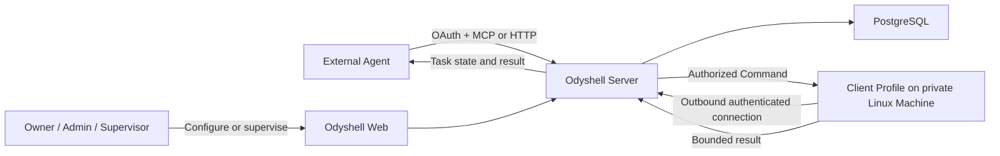
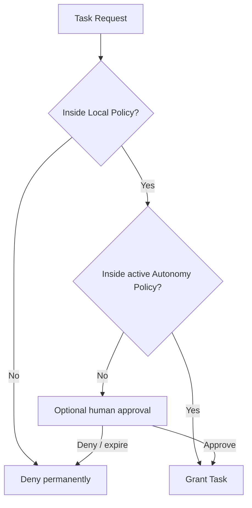

# Agent-native Task model

> **Status:** Accepted architecture. The public Server, Web, HTTP, MCP, and Linux Client execution
> surfaces are Task-native; removal of superseded protocol and persistence implementations is still
> in progress.

## Product contract

Odyshell lets an external AI Agent diagnose and remediate one real private Linux Machine through
temporary non-interactive shell authority, without SSH credentials, inbound ports, VPN membership,
or permanent machine access.

The Agent is the primary user. Humans establish trust, set policy ceilings, supervise exceptional
Tasks, and inspect evidence. The dashboard is never a required hop for normal execution inside an
approved Autonomy Policy.

Odyshell is not a terminal, VPN, PAM suite, agent runtime, sandbox, secrets manager, runbook
catalogue, scheduler, or multi-agent orchestrator.

## System shape

Server, Web, PostgreSQL, and identity run from the same code and data model in Cloud and
self-hosted deployments. Cloud hosts multiple Organizations. The self-hosted MVP bootstraps
exactly one Organization and does not depend on Odyshell Cloud, an external identity provider,
telemetry, a relay, or a license check.

## Canonical domain

An Organization owns every identity and resource. Workspace is removed.

An Agent is a durable identity in exactly one Organization. Registering it or enrolling a Machine
grants no Machine authority. Vendor humans do not join the customer's Organization; they operate
the Agent from the vendor's own system.

A Task is immutable temporary authority for exactly:

- one Agent;
- one Machine and Client Profile;
- the operating-system user running that Client Profile;
- one expiry;
- one concurrency ceiling.

A Command is one asynchronous native shell execution inside a Task. It contains only:

- command text;
- an optional absolute working directory;
- a timeout bounded by the Task expiry.

There is no caller-supplied environment or standard input. The Client supplies a minimal
allowlisted environment. Secrets must already exist on the Machine under the selected
operating-system user's authority.

## Authorization hierarchy

Local Policy is the absolute ceiling and is changed only on the Machine. It selects the Server,
Organization, operating-system user, maximum Task duration, concurrency, and whether remote human
approval is permitted. It never names Agents. Neither the Server nor Web can expand it.

Autonomy Policy is narrower Organization policy. It selects exact Agents and Machines, maximum
duration, concurrency, and expiry. It never filters shell strings. Shell allowlists and blocklists
are not security boundaries and are not implemented.

Revoking or expiring a Task prevents new Commands and terminates the active process tree. It does
not reverse prior effects on files, services, databases, or remote systems.

## Identity

Odyshell Identity uses Better Auth and PostgreSQL rather than Clerk or custom authentication
cryptography.

Human access supports local email and password. Generic OIDC is optional for self-hosted
deployments and Google OAuth is optional in Cloud. Human roles are Owner, Admin, and Supervisor.

Agents use OAuth:

- Authorization Code with PKCE for remote MCP clients that can open a browser;
- Client Credentials for headless runtimes pre-registered by an Admin;
- short-lived access tokens with rotation and immediate revocation;
- a distinct identity and credential set for every Organization.

No Agent can self-register. Initial trust always requires one explicit Admin action.

Machine Enrollment remains separate. A short-lived single-use enrollment token binds an
Ed25519 Client Profile identity to one Organization and Machine. Replays and cross-Organization
use fail closed.

## Interfaces

HTTP is the canonical protocol and authorization path. Remote MCP is a first-class adapter over
that same path. It has no privileged permissions and never receives host credentials.

The public agent interface is intentionally small:

- discover Machines available to the Agent;
- request, inspect, complete, or cancel a Task;
- create, inspect, read bounded output from, or cancel a Command;
- inspect the Agent's Task Timeline.

The CLI installs and diagnoses Client Profiles and performs local administrative recovery. It is
not a second agent protocol. There is no separately supported public SDK in the MVP.

Every mutation is idempotent. Creating a Command returns an identifier immediately. Agents poll
Task and Command status with cursors; a disconnected caller can resume without repeating work.

## Execution

The supported Client target is Linux with glibc and systemd on x86_64 or ARM64. Release verification
covers current supported Ubuntu, Debian, and Rocky Linux versions.

Each Client Profile runs as a pre-existing operating-system user. Odyshell does not create users,
configure sudo, interpret commands, or provide a sandbox. To expose different authority, the
operator installs a separate Client Profile under a different operating-system user.

The Client executes each Command in its own systemd scope or equivalent cgroup so cancellation,
expiry, restart reconciliation, process limits, and descendant termination remain enforceable.
The distributed `ods` artifact is a signed standalone binary per architecture and does not require
Node.js or a package manager. Updates are explicit, version-pinned, and signature-verified by
default.

## Audit and privacy

Every Command permanently records, subject to operator-configured retention:

- Organization, Agent, Task, Machine, and Client Profile identity;
- operating-system user;
- exact command text and working directory;
- request, start, finish, cancellation, and expiry timestamps;
- exit status, timeout, cancellation, and bounded output sizes.

Standard output and standard error return to the Agent through bounded transient delivery. Their
durable retention is disabled by default and may be enabled by the self-hosted operator. Credentials,
authorization headers, cookies, and identity secrets are never audit content.

Audit is attributable but not immutable against the administrator of a self-hosted installation.
Odyshell makes no tamper-proof or compliance certification claim in the MVP.

## Trust model

The Server is trusted. A compromised Server cannot expand Local Policy, but it can abuse authority
that Local Policy already permits. The MVP does not claim end-to-end authorization against its own
control plane.

A compromised Agent is limited to its Organization, active Autonomy Policy, Task TTL, Machine,
operating-system user, and concurrency. Since shell is arbitrary, any allowed Command has the full
authority of that operating-system user, including its files, credentials, network, services, and
persistent side effects.

A compromised Client can falsify results and can access everything available to its operating-system
user. The Server treats Client output as execution evidence, not a trusted attestation of machine
state.

The implementation must test denial and abuse for token expiry and revocation, replay,
cross-Organization access, confused-deputy routing, command/request idempotency, process-tree
termination, reconnect, output bounds, credential leakage, and production fail-closed defaults.

## Deliberate exclusions

- terminal sessions, PTYs, VPN, port forwarding, or general private-network access;
- typed filesystem, structured process, or Docker interfaces;
- multi-Machine Tasks, Managed Agents, Agent delegation, or agent orchestration;
- caller-provided environment, stdin, secret injection, or secret storage;
- command allowlists, semantic command safety, rollback, or sandbox claims;
- Windows, macOS, musl, alternative init systems, Kubernetes, or browser automation;
- public SDK, local stdio MCP, runbooks, scheduling, webhooks, SIEM, SCIM, or HA;
- Stripe and automated billing enforcement in the first tested MVP.

## Delivery order

1. Replace the domain and protocol contracts without compatibility aliases.
2. Replace Clerk and Workspace with Odyshell Identity and Organization.
3. Implement Task and Command persistence, authorization, audit, and denial tests.
4. Reduce the Client to the Linux shell executor and enforce process-tree lifecycle.
5. Expose the canonical HTTP module and remote MCP adapter.
6. Deliver the standalone `ods` installer and sovereign Compose deployment.
7. Complete the necessary dashboard and onboarding surfaces.
8. Verify the real-machine end-to-end workflow and update public documentation.
9. Define exact Cloud pricing and redesign the landing only after product behavior is final.
