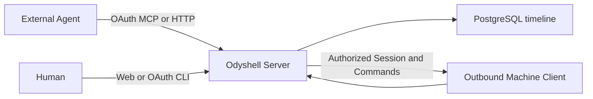
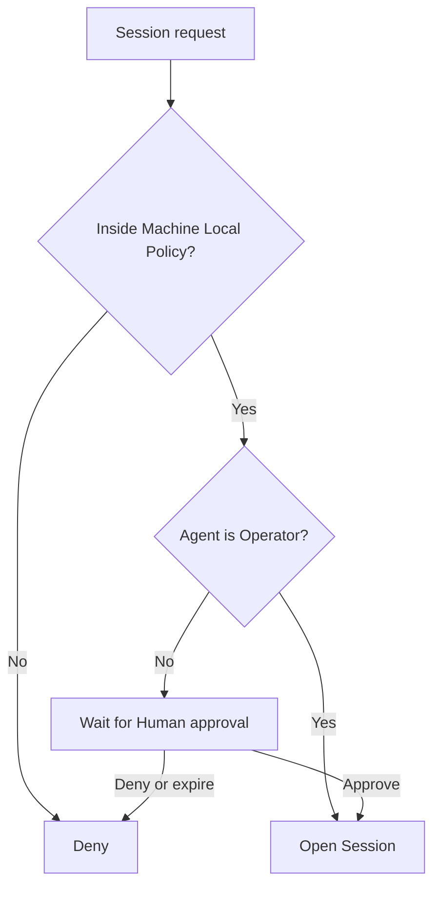

# Session control plane

> **Status:** Accepted architecture and current product contract.

## Product contract

Odyshell gives an external AI Agent temporary, attributable, non-interactive shell authority on a
real Windows, Linux, or macOS Machine without sharing SSH credentials, opening inbound ports, or
joining a VPN.

Odyshell is not a terminal, VPN, PAM suite, sandbox, secrets manager, scheduler, or multi-agent
orchestrator. Commands run with the privileges of the operating-system user that runs the Client.

## Canonical domain

An **Organization** owns its Humans, Agents, Machines, Sessions, Commands, and timeline. It is the
sovereign tenant boundary of one self-hosted installation.

An **Agent** is a durable OAuth identity with one role:

- **Standard** requests a Session and waits for an explicit Human approval;
- **Operator** bypasses explicit approval and is equivalent in trust to giving that Agent SSH.

A **Machine** runs one outbound Client Profile as one operating-system user. Enrollment creates no
Agent authority. Its **Local Policy** is a hard ceiling over Organization, duration, concurrency,
command timeout, output, and whether remote approval is allowed.

A **Session** grants one Agent authority over one Machine and Client Profile until one exact expiry.
The selectable durations are 15 minutes, 1 hour, 2 hours, 6 hours, 8 hours, and 24 hours. An Agent
may complete or cancel its Session early. Role downgrade, Agent deletion, Machine revocation, and
expiry revoke active authority and terminate active process trees.

A **Command** is one asynchronous shell execution inside an active Session. Callers provide command
text, an optional absolute working directory, and a bounded timeout. There is no caller-provided
environment, standard input, or PTY.

## Authorization

Authorization is enforced by the Server and independently bounded by the Client. The Agent is
never trusted to enforce its own role, Local Policy, Organization boundary, expiry, concurrency,
idempotency, or output limit.

Human web and CLI access uses short-lived OAuth tokens. Owners and Admins manage Agent roles and
deletion; Owners, Admins, and Supervisors approve or deny Sessions. Agent access uses a distinct
OAuth principal. Machine Enrollment uses a short-lived, single-use token followed by an Ed25519
Client identity.

## Interfaces

Canonical HTTP and remote OAuth MCP share the same Session service. Agents can list Machines;
request, inspect, complete, or cancel Sessions; and create, inspect, read output from, or cancel
Commands. Human web and CLI interfaces can inspect the Organization, supervise Sessions, manage
Agent roles, remove Agents, ping Machines, and read Session timelines.

Every mutation is idempotent. Disconnects do not silently repeat Commands. The Client reconnects
outbound and reconciles Session and Command state.

## Audit, privacy, and trust

The timeline records Agent, Human approver when applicable, Machine, Client Profile, operating-system
user, exact command, working directory, lifecycle timestamps, exit state, bounded stdout/stderr, and
revocation events. Command output is retained for 30 days by default and is configurable from 1 to
365 days. Credentials, bearer tokens, cookies, and Machine private keys are never timeline content.

The Server is trusted, though it cannot widen Local Policy. A compromised Operator Agent can use the
full authority already exposed by the Client user until revocation or expiry. A compromised Client
can falsify output and access everything available to its operating-system user. Odyshell provides
attribution and revocation, not rollback or tamper-proof attestation.

Security verification covers expiry and revocation, replay, cross-Organization and cross-Agent
access, confused-deputy routing, command injection at service boundaries, path validation, process
tree termination, reconnect, output bounds, and credential leakage.

## Distribution

Odyshell is free, Apache-2.0, and self-hosted through Docker. It has no managed SaaS tier or
commercial member, Machine, or Agent limits. Technical resource ceilings and Machine Local Policy
remain mandatory security controls.

Member invitations remain intentionally disabled until transactional email delivery is configured.
