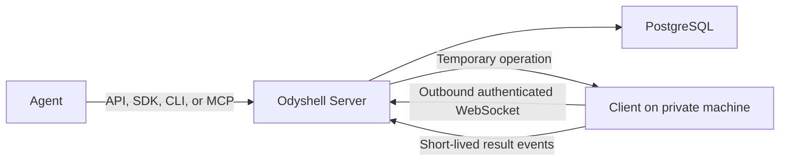

# Odyshell MVP

## Goal

Prove that an AI agent can perform a bounded task on an existing private machine without SSH
credentials, inbound connectivity, a VPN, or a full agent runtime installed on that machine.

The MVP serves agents through APIs. Humans are administrators.

## Current system

The Client establishes the connection. The Server never opens a connection into the machine's
private network.

## Current capabilities

| Area | MVP behavior |
| --- | --- |
| Platforms | Linux, macOS, and Windows Clients |
| Processes | Structured executable calls and explicit Host Shell commands |
| Filesystem | Resource-bounded stat, list, search, read, write, mkdir, and remove |
| Docker | Container log access and an optional Docker execution profile |
| Identity | Ed25519 machine identity |
| Enrollment | Single-use, expiring enrollment tokens |
| Agents | Persistent identities with expiring, rotatable credentials and no machine authority |
| Sessions | Temporary, browser-approved authority with per-machine scopes and credentials |
| Reliability | Reconnection, heartbeat, ping, cancellation, and idempotency |
| Interfaces | HTTP API, TypeScript SDK, `ods` CLI, and remote OAuth MCP |
| Persistence | PostgreSQL through Kysely |
| Tenancy | Organizations own isolated execution Workspaces |

Host execution is the default because the product is intended to operate on a real machine. The
Client process should run as a dedicated operating-system user with only the privileges required
for its approved Operations.

## Security boundary

An operation is accepted only when:

1. the Agent Credential is valid, unexpired, and bound to the requesting Agent;
2. the approved Session includes the target machine and typed restriction;
3. the credential, machine, Session, Operation, and Control Events belong to the same Workspace;
4. the Session includes the required capability;
5. the session is active and unexpired;
6. the machine is online;
7. the Client's local policy allows the same capability;
8. structured filesystem Operations satisfy any exact path restriction in the Session.

The model cannot override these checks with a prompt.

Structured filesystem reads accept regular files up to 1 MiB, and writes accept up to 1 MiB of
decoded content. Directory listings accept up to 1,000 entries, and searches visit at most 2,048
nodes and 32 directory levels. Hitting a limit fails the Operation without a partial result.
Removal is limited to one file or empty directory; recursive removal is not exposed in the MVP.
Session closure and Operation deadlines cancel iterative filesystem work cooperatively and
suppress a late result. Relative Session scopes reject symlink roots and descendant symlinks that
resolve outside the approved subtree.

An allowed Host Shell command starts in the Client user's Home by default. An explicit per-command
working directory does not narrow its authority. It can perform anything available to that
operating-system user, including accessing files, credentials, network, and services. There is no
sandbox or isolation, and changes may persist after the Session ends. Odyshell restricts authority;
it does not prove that an allowed command is safe. The command process inherits an allowlisted
base environment rather than every Client variable; explicit environment values are ephemeral to
one Operation and never persisted. On POSIX, a login shell can still load same-user startup files.

Graceful cancellation stops the active process group. On POSIX, an abrupt Client crash can leave a
detached command running until it exits by itself or is stopped externally because the MVP has no
separate Operation supervisor. Restart reconciliation reports that execution as unknown.

## Privacy behavior

Odyshell is not a session recorder.

- Durable control events store lifecycle metadata, not command text, arguments, paths, file
  contents, stdout, or stderr.
- Persistable Operation action fields and result events are temporary delivery data. Environment
  values and standard input are excluded. The retained data becomes eligible for deletion after
  one hour by default.
- Content-minimal control events become eligible for deletion after 30 days by default.
- Both retention periods are configurable by the self-hosting administrator.

See [Privacy and event data](./privacy.md) for the exact boundary.

## What the MVP does not yet include

- billing and plan checkout;
- fine-grained custom human roles beyond Owner, Admin, and Supervisor;
- object-storage or native SIEM event destinations beyond the signed HTTPS Event Sink;
- SSO, SCIM, billing, or compliance certification;
- high-availability routing across multiple Server replicas;
- semantic tracking of every side effect made by a Host Shell command;
- Kubernetes, browser automation, mobile devices, or GPU orchestration.

These are not implied by the current API.

## Current validation milestone

The web control plane now supports the smallest complete design-partner workflow:

1. a member signs in through Odyshell Identity, selects an Organization, and authorizes `ods login`;
2. the member generates a single-use command and runs it on a machine with an explicit local
   capability policy; the target machine does not need a separate CLI login;
3. an Agent registers a persistent identity without receiving machine authority;
4. the Agent requests and claims a browser-approved Session for explicit machines and Operations;
5. the member cancels the Session or lets it expire and reviews its privacy-minimal Timeline.

The milestone succeeds when a design partner can complete this workflow reliably on a real task.
Billing, customer-owned event delivery, and additional governance come after product validation.
