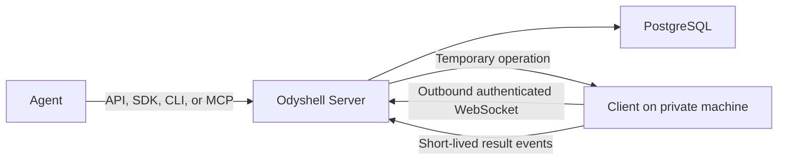

# Odyshell MVP

## Goal

Prove that an AI agent can perform a bounded task on an existing private machine without SSH
credentials, inbound connectivity, a VPN, or a full agent runtime installed on that machine.

The MVP serves agents through APIs. Humans are administrators.

## Current system

The Client establishes the connection. The Server never opens a connection into the machine's
private network.

## Current capabilities

| Area | MVP behavior |
| --- | --- |
| Platforms | Linux, macOS, and Windows Clients |
| Processes | Structured executable calls and explicit shell commands |
| Filesystem | Stat, list, search, read, write, mkdir, and remove |
| Docker | Container log access and an optional Docker execution profile |
| Identity | Ed25519 machine identity |
| Enrollment | Single-use, expiring enrollment tokens |
| Agent Access | Expiring and revocable credentials scoped to explicit machines and capabilities |
| Sessions | Temporary and bounded by the creating Agent Access |
| Reliability | Reconnection, heartbeat, ping, cancellation, and idempotency |
| Interfaces | HTTP API, TypeScript SDK, `ods` CLI, and local MCP server |
| Persistence | PostgreSQL through Kysely |
| Tenancy | Organizations own isolated execution Workspaces |

Host execution is the default because the product is intended to operate on a real machine. The
Client process should run as a dedicated operating-system user with only the privileges required
for the configured workspace and operations.

## Security boundary

An operation is accepted only when:

1. Agent Access is valid and unexpired;
2. the token includes the target machine;
3. the token, machine, session, operation, and control events belong to the same Workspace;
4. the token includes the required capability;
5. the session is active and unexpired;
6. the machine is online;
7. the Client's local policy allows the same capability;
8. filesystem paths remain inside the configured local directory.

The model cannot override these checks with a prompt.

An allowed direct process or shell command can still perform anything available to the operating
system user running the Client. Odyshell restricts authority; it does not prove that an allowed
command is safe.

## Privacy behavior

Odyshell is not a session recorder.

- Durable control events store lifecycle metadata, not command text, arguments, paths, file
  contents, stdout, or stderr.
- Full operation requests and result events are temporary delivery data. They become eligible for
  deletion after one hour by default.
- Content-minimal control events become eligible for deletion after 30 days by default.
- Both retention periods are configurable by the self-hosting administrator.

See [Privacy and event data](./privacy.md) for the exact boundary.

## What the MVP does not yet include

- billing and plan checkout;
- fine-grained custom human roles beyond Clerk organization members and administrators;
- human approval workflows;
- customer-owned webhook, object-storage, or SIEM event sinks;
- SSO, SCIM, billing, or compliance certification;
- high-availability routing across multiple Server replicas;
- semantic tracking of every side effect made by a shell command;
- Kubernetes, browser automation, mobile devices, or GPU orchestration.

These are not implied by the current API.

## Current validation milestone

The web control plane now supports the smallest complete design-partner workflow:

1. a member signs in to a Clerk Organization and authorizes `ods login`;
2. the member enrolls a machine with an explicit local capability policy;
3. the member creates temporary Agent Access for explicit machines and capabilities;
4. the agent works through the API, SDK, CLI, or MCP;
5. the member revokes access or lets it expire and reviews privacy-minimal Control Events.

The milestone succeeds when a design partner can complete this workflow reliably on a real task.
Billing, customer-owned event delivery, and additional governance come after product validation.
