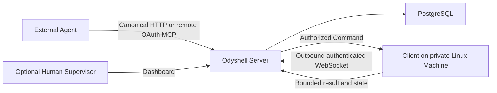

# Odyshell MVP

## Goal

Prove that an external AI Agent can diagnose and remediate one existing private Linux Machine
through temporary non-interactive shell authority, without SSH credentials, inbound connectivity,
a VPN, or a general-purpose agent runtime on that Machine.

Agents are the primary operators. Humans establish trust, set policy, optionally supervise
exceptions, and inspect evidence.

## Shipped system

The Client establishes the connection. The Server never opens a connection into the Machine's
private network. Cloud and self-hosted deployments use the same Server, Web, identity, database,
protocol, and Client code.

## Public product model

| Area | MVP behavior |
| --- | --- |
| Platform | Linux Client running as a pre-existing operating-system user |
| Identity | Better Auth Humans, OAuth Agents, and Ed25519 Machine identity |
| Enrollment | Single-use, expiring, Organization-bound Machine enrollment; Agent optional |
| Agent authority | One temporary Task binds one Agent to one Machine and OS user |
| Execution | Asynchronous non-interactive shell Commands |
| Policy | Machine-owned Local Policy ceiling and narrower Autonomy Policy |
| Reliability | Reconnect reconciliation, heartbeat, cancellation, expiry, and idempotency |
| Agent interfaces | Canonical OAuth HTTP and remote OAuth MCP |
| Human interface | Dashboard for setup, optional supervision, revocation, and audit |
| Persistence | PostgreSQL through a parameterized control repository and the Kysely Task repository |
| Tenancy | Organizations isolate identities and resources |

There is no public Session, Operation, typed-filesystem, Docker-execution, local MCP, or SDK
interface. The CLI installs, diagnoses, updates, and recovers Machine Clients; it is not an Agent
protocol.

## Authorization boundary

A Command is accepted only when all of these remain true:

1. the OAuth credential is valid, unexpired, unrevoked, and bound to the Agent and Organization;
2. the Task belongs to the same Agent, Organization, Machine, and Client Profile;
3. Local Policy permits the Organization, duration, concurrency, timeout, and output bound;
4. Autonomy Policy permits automatic execution, or an Owner, Admin, or Supervisor approved the
   Task without widening Local Policy;
5. the Task is active and unexpired, the Machine is online, and its Client acknowledges authority;
6. the idempotency key is either new or bound to exactly the same request.

The model cannot override these checks with a prompt. Cross-Organization, cross-Agent, expired,
revoked, replayed, malformed, and over-limit requests fail closed.

## Shell authority

Each Command contains complete shell text, an optional absolute working directory, and a timeout
bounded by the Task. Caller-provided environment variables, standard input, PTYs, and persistent
shell state are not supported.

Commands run as the operating-system user that runs the Client. There is no sandbox, rollback,
sudo setup, or command filter. An allowed Command can access every file, credential, network,
service, and side effect available to that user. Operators should use a dedicated account without
root, sudo, or Docker membership and grant it only the authority the Agent needs.

Cancellation and Task closure request termination of the active process tree. Completed side
effects cannot be reversed. After ambiguous transport or process failure, reconciliation reports
an unknown or failed outcome instead of claiming success.

## Agent workflow

1. An Admin registers or authorizes one durable Agent identity.
2. The Machine owner installs a Client with a conservative Organization-bound Local Policy.
3. The Agent discovers an available Machine and requests a bounded Task.
4. The Task starts automatically inside Autonomy Policy or waits for optional Human approval.
5. The Agent creates Commands, polls their state, and reads bounded transient output with a cursor.
6. The Agent completes the Task, cancels it, or lets it expire.
7. Humans and the Agent can inspect attributable Task and Command evidence.

Every mutation uses an idempotency key. A disconnected Agent resumes existing Task and Command
resources instead of recreating authority or work.

## Audit and privacy

Durable evidence binds Organization, Agent, Machine, Client Profile, Task, exact Command, working
directory, timeout, policy decision, status, exit code when known, and lifecycle timestamps.
OAuth credentials, cookies, enrollment secrets, and identity secrets are never audit content.

Standard output and standard error are bounded transient delivery data and are not retained by
default. Audit is attributable, but the MVP does not claim that evidence is immutable against the
administrator of a self-hosted deployment.

See [Privacy and event data](./privacy.md) for the detailed boundary.

## Deliberate exclusions

- terminal sessions, PTYs, SSH proxying, VPN, port forwarding, or private-network access;
- typed filesystem, structured process, or Docker execution APIs;
- multiple Machines per Task, Managed Agents, delegation, or agent orchestration;
- caller-provided environment, stdin, secret injection, or secret storage;
- command allowlists, semantic safety, rollback, or sandbox claims;
- public SDK, local stdio MCP, webhooks, Event Sinks, scheduling, runbooks, SIEM, SCIM, or HA;
- Windows or macOS Clients, billing automation, and compliance certification.

These exclusions are intentional and are not implied by the current API or dashboard.

## Current validation milestone

The smallest complete design-partner workflow is now the product path: establish an Organization,
authorize an Agent, enroll a customer-controlled Linux Machine, complete a real Task through HTTP
or MCP, optionally supervise it, revoke authority when necessary, and inspect the exact-command
audit trail. Pricing and formal validation thresholds remain intentionally undecided until pilots
produce evidence.
