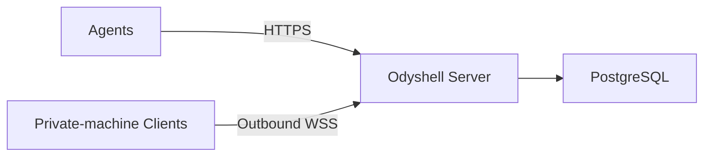

# Self-hosting Odyshell

Odyshell needs two services:



Clients never need inbound ports. Only the Server needs an address reachable by agents and
Clients.

Install the CLI wherever you administer or connect machines:

```bash
npm install --global @odyshell/cli
```

## Try it locally

```bash
pnpm install
docker compose up -d --build
curl --fail http://127.0.0.1:4100/health
```

Compose starts the Server and PostgreSQL. Its named volume keeps state across restarts. The
included passwords and keys are development defaults; do not expose this setup to the internet.

Before upgrading an existing installation, take a PostgreSQL snapshot. The authority cutover
keeps Workspaces, machines, Client Profiles and retained events, but revokes legacy Agent Access
credentials and their active Sessions. Register integrations again with `ods agent login`.

Rollback may restore application or schema compatibility, but it never reactivates revoked
secrets. Restore a pre-cutover snapshot only before accepting new Sessions.

## Run it on your infrastructure

Provide a PostgreSQL database and build the Server:

```bash
docker build -f apps/server/Dockerfile -t odyshell-server .
```

Store production configuration outside the repository:

```dotenv
NODE_ENV=production
HOST=0.0.0.0
PORT=4100
DATABASE_URL=postgresql://<user>:<password>@<host>:5432/<database>?sslmode=verify-full
ODYSHELL_ADMIN_KEY=<strong-random-admin-key>
ODYSHELL_OPERATION_RETENTION_SECONDS=3600
ODYSHELL_AUDIT_RETENTION_DAYS=30
```

Start the Server:

```bash
docker run -d \
  --name odyshell-server \
  --restart unless-stopped \
  --env-file /etc/odyshell/server.env \
  -p 127.0.0.1:4100:4100 \
  odyshell-server
```

Put the Server behind HTTPS before connecting over the internet. Never enable
`ODYSHELL_ALLOW_DEV_CREDENTIALS` in production.

## Optional remote MCP

The local `ods mcp` transport works without an identity provider. To let hosted MCP clients connect
directly, configure Clerk as the OAuth authorization server and enable dynamic client registration:

```dotenv
ODYSHELL_MCP_URL=https://mcp.example.com/mcp
ODYSHELL_MCP_ALLOWED_ORIGINS=https://app.example.com
CLERK_OAUTH_ISSUER=https://your-instance.clerk.accounts.dev
CLERK_SECRET_KEY=<clerk-secret-key>
CLERK_PUBLISHABLE_KEY=<clerk-publishable-key>
```

Point the MCP hostname at the same Server process. PostgreSQL keeps MCP installation and Session
bindings; OAuth tokens are verified with Clerk and are not stored by Odyshell. Accounts with one
Workspace can use `/mcp`; accounts with several use `/mcp/<workspace-id>`.

## Connect a machine

Create a single-use enrollment token:

```bash
ods --server https://ods.example.com --admin-key <admin-key> token create
```

The standalone Server creates a default organization and workspace automatically. Organization
membership is not managed by the CLI. If you need multiple human organizations, enable the cloud
web bridge and use Clerk Organizations; separate standalone deployments remain the smallest
self-hosted isolation boundary for the MVP.

On the private machine:

```bash
ods up \
  --server https://ods.example.com \
  --token <enrollment-token> \
  --name my-machine \
  --workspace /srv/my-app \
  --allow 'process.exec,fs.stat,fs.list,fs.search,fs.read'
```

Create one hour of scoped access and verify it:

```bash
ods \
  --server https://ods.example.com \
  --admin-key <admin-key> \
  agent create my-agent \
  --machines my-machine \
  --allow 'process.exec,fs.stat,fs.list,fs.search,fs.read' \
  --for 1h

ods login --server https://ods.example.com --agent-token <agent-token>
ods ping my-machine
```

## Production checklist

- Back up PostgreSQL and require TLS.
- Set operation and control-event retention deliberately; remember that backups have independent
  retention.
- Keep the admin key and database credentials outside the repository.
- Expose the Server through HTTPS/WSS.
- Run each Client as a dedicated operating-system user with least privilege.
- Grant only the required workspace, capabilities, and duration.
- Keep one Server replica for the MVP because live Client connections are held in memory.
