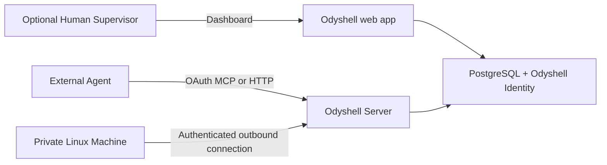

# Self-hosting Odyshell

Self-hosted Odyshell runs the web app, Better Auth identity layer, Server, PostgreSQL, remote MCP
adapter, dashboard, and Linux Client protocol on infrastructure you control. The deployment owner
keeps identity, policy, Task, audit, and credential data in its own PostgreSQL database.



## Local evaluation

```bash
pnpm install
cp .env.example .env
cp apps/web/.env.example apps/web/.env.local
```

Set a random `BETTER_AUTH_SECRET` of at least 32 characters and the same random
`ODYSHELL_WEB_KEY` in both files. Then start the local-only Compose stack:

```bash
docker compose up -d --build
curl --fail http://127.0.0.1:4100/health
```

Open `http://localhost:3000`, create the first account, and bootstrap the Organization. The
Compose file binds ports to loopback by default and enables explicit development credentials on
the Server; do not expose it to the Internet or treat it as the production manifest.

## Production requirements

Deploy the Server and web images with:

- PostgreSQL over TLS, protected backups, and a tested restore procedure;
- `NODE_ENV=production` for both services;
- `ODYSHELL_ALLOW_DEV_CREDENTIALS` absent;
- a stable random `BETTER_AUTH_SECRET` of at least 32 characters;
- one stable random `ODYSHELL_WEB_KEY` shared only between web and Server;
- canonical HTTPS `BETTER_AUTH_URL`, public Server URL, web URL, and MCP URL;
- `ODYSHELL_IDENTITY_ISSUER` and `ODYSHELL_IDENTITY_JWKS_URL` matching the web identity service;
- secrets supplied by the deployment platform rather than committed environment files;
- one Server replica for the MVP because live Client connections are in memory.

Optional Google or generic OIDC sign-in adds identity providers without replacing local
email/password. Self-hosted mode remains single-Organization.

## Connect an Agent and Machine

1. Add `https://api.ods.example.com/mcp` to the external Agent runtime.
2. Complete OAuth and approve the Organization-bound Agent installation.
3. Install the Machine CLI as a dedicated least-privilege Linux user:

   ```bash
   npm install --global @odyshell/cli
   ```

4. In **Machines**, select **Add Machine**, choose the Agent, and run the generated command:

   ```bash
   ods --server https://api.ods.example.com up \
     --token <single-use-token> \
     --name production-api \
     --agent-id <agent-id>
   ```

5. From the Agent, call `machines_list`, `task_request`, `command_run`, `command_get`,
   `command_output`, and `task_complete`.

The Machine needs no inbound port, SSH credential, or VPN route. Enrollment fails before token
consumption when the Organization lacks its sovereign identity binding. The Client independently
denies mismatched Organization or Agent identity and any request outside Local Policy.

## Operations checklist

- Run each Client as a dedicated Linux user without root, sudo, or Docker membership.
- Back up PostgreSQL and account for independent proxy and backup retention.
- Monitor Server, web, PostgreSQL, and Client service health.
- Rotate web/OIDC credentials deliberately; never copy Machine private keys or enrollment tokens.
- Keep the web app and Server on the same release and update Client patch releases with
  `ods client update`.
- Verify a real Task and Command after deployment, including optional approval, reconnect, output
  pagination, cancellation, and explicit completion.
