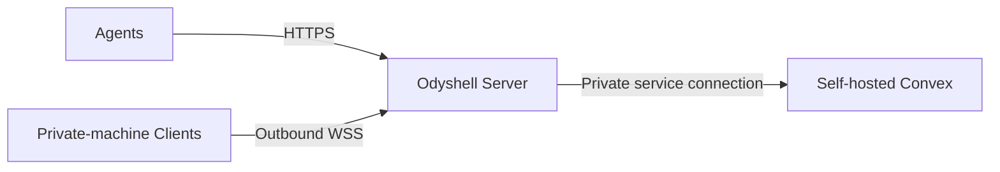

# Self-hosting Odyshell

Odyshell can run entirely on infrastructure you control. A minimal persistent installation has
three parts:



The Clients do not need inbound ports. Only the Odyshell Server needs a stable address that agents
and Clients can reach.

> **Important:** the repository's `docker-compose.yml` is a disposable development environment.
> It uses `ODYSHELL_STORAGE=memory`, so machines, tokens, sessions, and audit data are lost whenever
> the Server restarts. It is not a production self-hosting configuration.

## 1. Run Convex

Follow the official [Convex self-hosting guide](https://docs.convex.dev/self-hosting) to start its
backend with persistent storage. Keep the Convex dashboard and administrative key private.

Configure this repository's Convex CLI with the self-hosted URL and admin key as described in that
guide. The resulting `.env.local` must never be committed.

Deploy the Odyshell schema and functions:

```bash
pnpm install
npx convex dev --once
```

Create a random service key and store it in Convex:

```bash
npx convex env set ODYSHELL_SERVICE_KEY
```

Convex prompts for the value without requiring it in shell history. Save the same value securely
for the Odyshell Server.

## 2. Run the Odyshell Server

Build the Server image:

```bash
docker build -f apps/server/Dockerfile -t odyshell-server .
```

Create an environment file outside the repository, for example
`/etc/odyshell/server.env`:

```dotenv
NODE_ENV=production
HOST=0.0.0.0
PORT=4100
CONVEX_URL=<self-hosted-convex-url>
ODYSHELL_CONVEX_SERVICE_KEY=<same-service-key>
ODYSHELL_ADMIN_KEY=<strong-random-admin-key>
```

Restrict access to this file and start the Server:

```bash
chmod 600 /etc/odyshell/server.env
docker run -d \
  --name odyshell-server \
  --restart unless-stopped \
  --env-file /etc/odyshell/server.env \
  -p 127.0.0.1:4100:4100 \
  odyshell-server
```

This binds the Server to the host's loopback interface. Put it behind HTTPS before connecting
machines over the internet; a reverse proxy such as Caddy or Nginx can terminate TLS. Do not use
the development keys or enable
`ODYSHELL_ALLOW_DEV_CREDENTIALS` in production.

Check the deployment:

```bash
curl --fail https://ods.example.com/health
```

## 3. Connect a machine

Create a single-use enrollment token with the administrator key:

```bash
ods \
  --server https://ods.example.com \
  --admin-key <admin-key> \
  token create
```

On the private machine:

```bash
ods up \
  --server https://ods.example.com \
  --token <enrollment-token> \
  --name my-machine \
  --workspace /srv/my-app \
  --allow process.exec,fs.stat,fs.list,fs.search,fs.read
```

The machine now maintains its outbound connection. Verify the complete path:

```bash
ods \
  --server https://ods.example.com \
  --admin-key <admin-key> \
  agent create selfhost-agent \
  --machines my-machine \
  --allow process.exec,fs.stat,fs.list,fs.search,fs.read \
  --for 1h

ods login \
  --server https://ods.example.com \
  --agent-token <agent-token> \
  --admin-key <admin-key>

ods ping my-machine
```

## Production checklist

- Persist and back up the Convex data volume.
- Keep Convex administrative credentials separate from the Odyshell service key.
- Keep the admin key and service key outside the repository.
- Expose the Odyshell Server through HTTPS/WSS.
- Run each Client as a dedicated operating-system user with least privilege.
- Grant only the required workspace and capabilities.
- Keep one Server replica for the MVP because live Client connections are held in memory.
