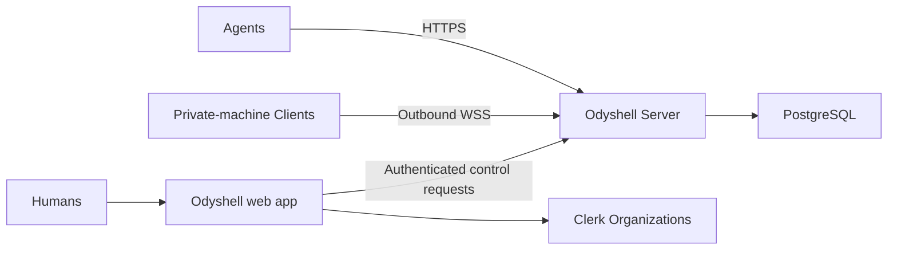

# Self-hosting Odyshell

Odyshell's data plane needs the Server and PostgreSQL. The implemented production Session flow
also needs the Odyshell web app and Clerk Organizations for human identity and approval:



Clients never need inbound ports. The Server needs an address reachable by Agents, Clients, and
the web app; people reach the web app through HTTPS.

Install the CLI wherever you administer or connect machines:

```bash
npm install --global @odyshell/cli
```

## Try it locally

```bash
pnpm install
cp .env.example .env
cp apps/web/.env.example apps/web/.env.local
```

Create a Clerk application with Organizations enabled and replace the Clerk keys in
`apps/web/.env.local`. Set the same random `ODYSHELL_WEB_KEY` in `.env` and
`apps/web/.env.local`; keep `ODYSHELL_WEB_URL=http://localhost:3000`. Then start PostgreSQL and the
Server:

```bash
docker compose up -d --build
curl --fail http://127.0.0.1:4100/health
```

In another terminal, start the web app and create a Clerk Organization at
`http://localhost:3000`:

```bash
pnpm dev:web
```

Compose starts the Server and PostgreSQL. Its named volume keeps state across restarts. The
included passwords and keys are development defaults; do not expose this setup to the internet.
The development Agent key only authorizes the isolated `/v1/development/sessions` endpoint. It
rejects `host.shell` and `process.exec`; it does not make `ods exec`, `ods shell`, or `ods mcp` skip
the implemented browser-approved Session flow.

Before upgrading an existing installation, take a PostgreSQL snapshot. The authority cutover
keeps Workspaces, machines and retained events, but revokes legacy Agent Access credentials and
their active Sessions. Register integrations again with `ods agent login`.

Protocol v4 is a breaking Server/Client wire upgrade because recursive `fs.remove` is no longer
accepted. Update the Server and CLI together, then restart each Profile; existing Profile
configuration remains valid and re-enrollment is not required.

The older protocol v3 upgrade changed local Client Profile configuration. Remove each protocol v2
Profile and its stale machine record, then recreate and re-enroll it with a new command. Host
Profiles no longer accept `workspaceRoot` and start relative work in the operating-system user's
Home. Docker Profiles require `--runner docker --mount-source <absolute-path>` so their new
configuration has an explicit `mountSource`. Do not copy or hand-edit old Profile configuration.

Rollback may restore application or schema compatibility, but it never reactivates revoked
secrets. Restore a pre-cutover snapshot only before accepting new Sessions.

## Run it on your infrastructure

Provide a PostgreSQL database and build the Server:

```bash
docker build -f apps/server/Dockerfile -t odyshell-server .
```

Store production configuration outside the repository:

```dotenv
NODE_ENV=production
HOST=0.0.0.0
PORT=4100
DATABASE_URL=postgresql://<user>:<password>@<host>:5432/<database>?sslmode=verify-full
ODYSHELL_ADMIN_KEY=<strong-random-admin-key>
ODYSHELL_WEB_KEY=<shared-random-secret-at-least-32-characters>
ODYSHELL_WEB_URL=https://ods.example.com
ODYSHELL_OPERATION_RETENTION_SECONDS=3600
ODYSHELL_AUDIT_RETENTION_DAYS=30
```

Start the Server:

```bash
docker run -d \
  --name odyshell-server \
  --restart unless-stopped \
  --env-file /etc/odyshell/server.env \
  -p 127.0.0.1:4100:4100 \
  odyshell-server
```

Put the Server behind HTTPS before connecting over the internet. Never enable
`ODYSHELL_ALLOW_DEV_CREDENTIALS` in production.

## Deploy the human control plane

The current production Session flow requires the Odyshell web app and a Clerk application with
Organizations enabled. A Server-only deployment can expose health, enrollment, and administrator
endpoints, but it cannot issue Agent Credentials or approve Agent Sessions; normal execution fails
closed when `ODYSHELL_WEB_URL` is unavailable.

Configure the web app with:

```dotenv
NEXT_PUBLIC_CLERK_PUBLISHABLE_KEY=<clerk-publishable-key>
CLERK_SECRET_KEY=<clerk-secret-key>
NEXT_PUBLIC_ODYSHELL_SERVER_URL=https://api.ods.example.com
ODYSHELL_SERVER_URL=https://api.ods.example.com
ODYSHELL_WEB_KEY=<same-value-as-the-server>
```

Set both Server URL variables explicitly. `NEXT_PUBLIC_ODYSHELL_SERVER_URL` is the canonical URL
shown to browsers and included in self-hosted CLI commands. Odyshell never derives it from
`ODYSHELL_SERVER_URL`, which may be an internal deployment hostname that must not be disclosed to
Clients.

Build and start the implemented web application:

```bash
pnpm --filter @odyshell/web build
pnpm --filter @odyshell/web start
```

Expose it at the exact HTTPS origin configured as the Server's `ODYSHELL_WEB_URL`. The shared web
key stays between these two services; browsers and Agents never receive it.

## Optional remote MCP

The local `ods mcp` transport uses the Agent Credential registered through the human control plane
and does not require a separate MCP OAuth endpoint. To let hosted MCP clients connect directly,
configure Clerk as the OAuth authorization server and enable dynamic client registration:

```dotenv
ODYSHELL_MCP_URL=https://mcp.example.com/mcp
ODYSHELL_MCP_ALLOWED_ORIGINS=https://app.example.com
CLERK_OAUTH_ISSUER=https://your-instance.clerk.accounts.dev
CLERK_SECRET_KEY=<clerk-secret-key>
CLERK_PUBLISHABLE_KEY=<clerk-publishable-key>
```

Point the MCP hostname at the same Server process. PostgreSQL keeps MCP installation and Session
bindings; OAuth tokens are verified with Clerk and are not stored by Odyshell. Accounts with one
Workspace can use `/mcp`; accounts with several use `/mcp/<workspace-id>`.

Remote MCP requests either one or more exact typed Operations or explicit broad Host Shell
authority for approval. Host Shell requests identify the machine, objective, and duration without
an advance command list. They also require a stable Task Run `runId`; reuse requires both the same
MCP installation and `runId`, so unrelated work cannot inherit broad authority. Every execution
includes a stable Operation ID, so a transport retry returns the original Operation instead of
running it again. A failed command leaves the Session usable for corrective work. Completion is
explicit, records the overall Agent-reported task outcome, and fails closed while work is active.

## Connect a machine

Authorize the CLI through the deployed web app:

```bash
ods login --server https://api.ods.example.com
```

Open the printed URL, choose the Clerk Organization, and approve the CLI. Then create a single-use
enrollment token:

```bash
ods token create
```

The selected Clerk Organization owns the Workspace. Organization membership is not managed by the
CLI. Only the administrator CLI needs `ods login`; the target machine uses the generated
single-use enrollment token and does not log in separately.

On the private machine:

```bash
ods up \
  --server https://api.ods.example.com \
  --token <enrollment-token> \
  --name my-machine \
  --allow 'process.exec,host.shell,fs.stat,fs.list,fs.search,fs.read'
```

On the Agent runtime, register a persistent Agent identity and verify the machine:

```bash
ods agent login "My Agent" --server https://api.ods.example.com
ods ping my-machine
ods exec my-machine -- uname -a
ods shell --purpose "Inspect the user environment" my-machine "pwd && id"
```

Open and approve the Agent registration URL, then approve each Session URL printed by the
execution command (or approve a bounded Autoapproval Policy in the web app). `ods agent create` and
direct Session creation are legacy commands and intentionally return migration errors.

## Production checklist

- Back up PostgreSQL and require TLS.
- Set operation and control-event retention deliberately; remember that backups have independent
  retention.
- Keep the admin key and database credentials outside the repository.
- Expose the Server through HTTPS/WSS.
- Run each Client as a dedicated operating-system user with least privilege.
- Grant only the required resources, capabilities, and duration.
- Keep one Server replica for the MVP because live Client connections are held in memory.
