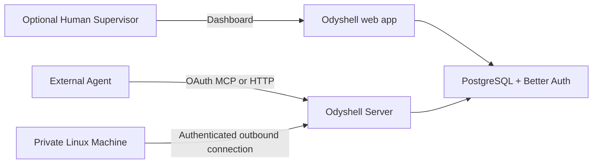

# Self-hosting Odyshell

Self-hosted Odyshell runs the same agent-facing protocols, Server, Better Auth identity, dashboard,
PostgreSQL schema, and Linux Client as Cloud. The deployment owner controls identity, policy,
Task, Command, audit, and credential data. Clerk and third-party analytics are not runtime
dependencies.



## Start a loopback deployment

Requirements: Docker with Compose and Node.js 24+ for the smoke test.

```bash
cp .env.example .env
```

Fill every blank secret in `.env`. Generate each application secret independently with a
cryptographically secure generator; `BETTER_AUTH_SECRET` and `ODYSHELL_WEB_KEY` must contain at
least 32 characters. `POSTGRES_PASSWORD` must be URL-safe because Compose places it in the internal
connection URL.

```bash
docker compose config
docker compose up -d --build
pnpm test:self-host
```

The manifest binds Web, Server, and PostgreSQL to `127.0.0.1` by default, runs application services
with `NODE_ENV=production`, and refuses to render when required secrets are absent. The smoke test
uses a clean database: it creates a local account whose Organization is provisioned automatically, verifies the
authenticated dashboard, proves a second Organization is denied, and confirms anonymous MCP and
dashboard requests fail closed.

Open `http://localhost:3000` after the smoke test. The smoke Organization already owns the
single-Organization deployment; use a fresh volume if you want to perform first-user onboarding
manually.

## Public deployment

Keep the ports private behind a TLS reverse proxy and set these values before building:

```dotenv
BETTER_AUTH_URL=https://app.example.com
NEXT_PUBLIC_ODYSHELL_SERVER_URL=https://api.example.com
ODYSHELL_MCP_URL=https://api.example.com/mcp
```

`BETTER_AUTH_URL` is the OAuth issuer and dashboard origin. The Server publishes
`ODYSHELL_MCP_URL` as its protected resource. `NEXT_PUBLIC_ODYSHELL_SERVER_URL` is embedded into the
Web image at build time, so changing only the running container environment is insufficient.

Production operators must also:

- keep the Compose network private: it intentionally permits HTTP only for JWKS fetches from the
  Server to the Web container; use HTTPS for that hop if it crosses a trusted network boundary;
- keep PostgreSQL private and use TLS when database traffic leaves the Docker network;
- encrypt backups and prove restoration works;
- store all secrets outside the repository and rotate them deliberately;
- run one Server replica because live Machine connections are process-local in this release;
- deploy Web and Server from the same release;
- monitor Web, Server, PostgreSQL, and every Client;
- run each Client as a dedicated user without root, sudo, or Docker membership.

Optional Google sign-in requires `GOOGLE_CLIENT_ID`, `GOOGLE_CLIENT_SECRET`, and
`NEXT_PUBLIC_GOOGLE_AUTH_ENABLED=true` before the Web image is built. Local email/password remains
available and no external identity provider is required.

Generic OIDC sign-in supports self-hosted IdPs such as Keycloak, Authentik, or ZITADEL. Set
`OIDC_CLIENT_ID`, `OIDC_CLIENT_SECRET`, and the HTTPS `OIDC_DISCOVERY_URL`; keep
`OIDC_PROVIDER_ID` and `NEXT_PUBLIC_OIDC_PROVIDER_ID` aligned, then set
`NEXT_PUBLIC_OIDC_AUTH_ENABLED=true` before building Web. Register
`/api/auth/oauth2/callback/<provider-id>` at the IdP. PKCE and strict issuer validation are
enforced.

## Connect an Agent and Machine

1. Add the Server's `/mcp` resource to the external Agent runtime.
2. Complete OAuth and approve the Organization-bound Agent installation.
3. Install the Machine CLI as a dedicated least-privilege Linux user:

   ```npm
   npm install --global @odyshell/cli
   ```

4. In **Machines**, select **Add Machine** and run the generated command:

   ```bash
   ods --server https://api.example.com up \
     --token <single-use-token> \
     --name production-api
   ```

5. From the Agent, call `machines_list`, `task_request`, `command_run`, `command_get`,
   `command_output`, and `task_complete`.

The Machine needs no inbound port, SSH credential, or VPN route. It belongs to the Organization,
not an Agent. The Client rejects a mismatched Organization, expired authority, replay, and any
request outside Local Policy; each authorized Task supplies the temporary Agent binding.

## Lifecycle

```bash
docker compose build --pull
docker compose up -d
docker compose logs --tail 200 server web
```

Before upgrades, back up PostgreSQL. Never copy Machine private keys or one-time enrollment tokens.
After upgrades, verify one real Task and Command, including approval when required, reconnect,
bounded output, cancellation, and explicit completion.
